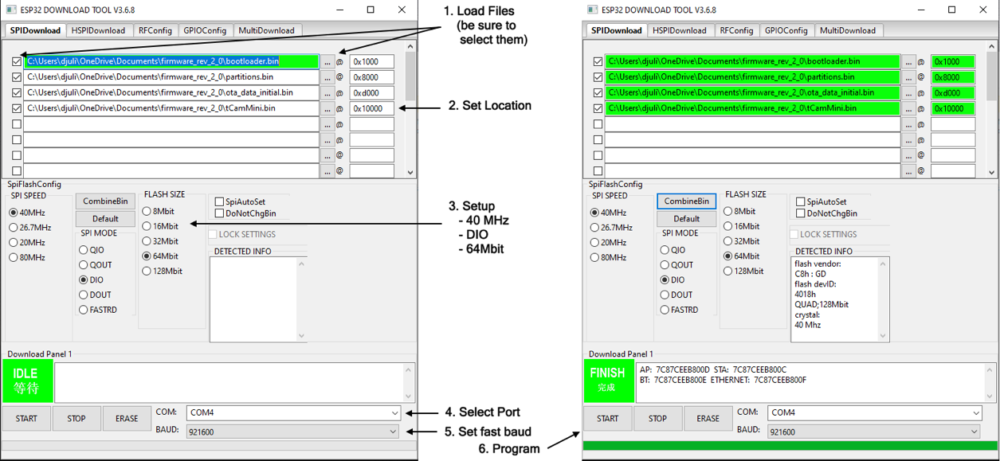

## tCam/tCam-Mini Firmware Serial Upload
There are three ways to load firmware into tCam.

1. Using the Espressif build process after compiling the firmware.
2. Using a download tool from Espressif to load the pre-compiled firmware from this repository.
3. Using the Desktop application and the over-the-air (OTA) capability in tCam-Mini (FW Revision 2.0 and beyond) and all tCam FW revisions.

The second option is described here.  It requires a Microsoft Windows computer.

### tCam-Mini version 2.0 FW (and beyond)
Starting with release 2.0 the tCam-Mini firmware supports OTA updates.  This capability makes use of multiple partitions in the ESP32 flash memory and requires an ESP32 with Revision 3 silicon and at least 8 MB Flash such as the board available from [Group Gets](https://store.groupgets.com/collections/frontpage/products/tcam-mini-with-lepton-3-5-wireless-streaming-thermal-camera-board).  Dev board based builds (for example using the TTGO T7 module) typically have only 4 MB of flash and Rev 1 silicon and must use the Revision 1.3 FW (ESP_v1_silicon).


### Download firmware files
tCam-Mini FW 2.0 and beyond require four binary files.

```
	firmware/precompiled/bootloader.bin
	firmware/precompiled/ota_data_initial.bin
	firmware/precompiled/tCamMini.bin
	firmware/precompiled/partitions_singleapp.bin
```

FW 1.3 requires three binary files.


```
	firmware/precompiled/ESP32_v1_silicon/bootloader.bin
	firmware/precompiled/ESP32_v1_silicon/tCam.bin
	firmware/precompiled/ESP32_v1_silicon/partitions_singleapp.bin
```

Download the three or four binary files from this repository to a known location.  All are required by the Espressif download tool.

### Connect Camera
Connect the camera to the Windows Computer to allow it to load a device driver for the camera's Silicon Labs USB-Serial chip.  After a few minutes the computer should load a driver and associate a COM port with the camera.  Make a note of this port.  You can find it in the Windows Device Manager.

### Install the Espressif download tool
Download the `flash_download_tools_v3.6.8.zip` file to a Windows computer.  Unzip it in a known location.  It will unzip a directory named `flash_download_tools_v3.6.8`.  Execute the ```flash_download_tools_v3.6.8``` binary from within that directory.

A shell window will appear and then after a few seconds a selection window will appear.


Click the `ESP32 Download Tool` button.  The ESP32 Download Tool program runs and displays a new window.

#### Programmer Setup




1. Load the three or four firmware files from the location you stored them by clicking on the `...` buttons as shown above under the `SPIDownload` tab.
2. Set the location in ESP32 memory for each file as shown above by clicking in the text fields to the right of each filename.
3. Configure the programming parameters in the `SpiFlashConfig` area.  Select SPI SPEED: 40 MHz, SPI MODE: DIO, FLASH SIZE: to match the flash size of your ESP32 module (4 MB Flash = 32 Mbit, 8 MB Flash = 64 MBit).  tCam-Mini PCBs have 8 MB Flash modules.  tCam-Mini's built from off-the-shelf development boards may have 4 MB Flash modules.
4. Select the COM port associated with the camera.
5. Set a fast baud rate of 921600 baud to reduce programming time.

#### Programming

1. Make sure the camera is on (tCam-Mini is on whenever connected to USB).  It will boot up but this does not matter (the programming software will reset it).
2. Press `START` to initiate programming.  A green progress bar will progress along the bottom of the window.  Programming should take 15-20 seconds.  The program will display `FINISH` upon a successful programming.
3. Disconnect the camera and then reconnect it.  The camera should boot into the new firmware.

