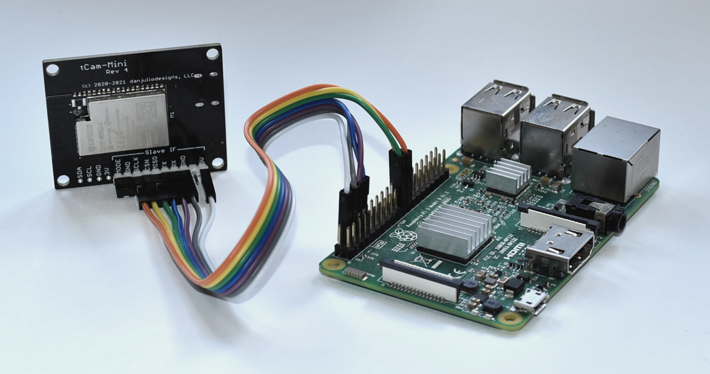
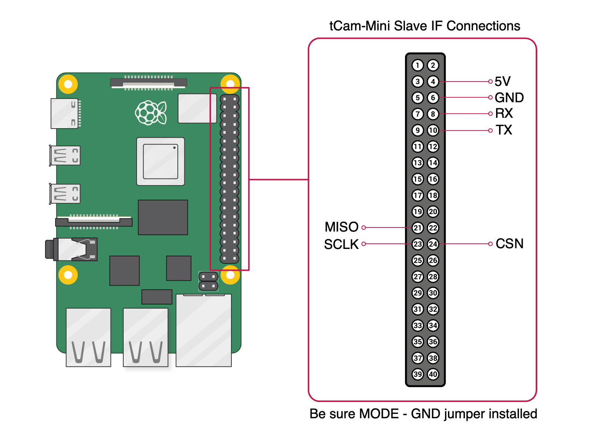

## tCam-Mini Python Driver
Todd LaWall (bitreaper) wrote a python 3 driver to allow access to tCam and tCam-Mini from python programs.  The driver supports accessing tCam and tCam-Mini via the network socket interface and also supports accessing tCam-Mini via the hardware Slave Interface on a Raspberry Pi.

### tcam.py
The ```tcam.py``` file contains an object ```TCam``` used to connect to and communicate with a camera.  It manages the network socket or direct hardware connection and provides an API for sending commands to the camera and for receiving responses back from the camera.  It uses three queues to handle the asynchronous nature of the interface.  A command queue is used for outgoing commands to the camera.  Responses from the camera are pushed into two incoming queues.  Image responses are stored in a special image queue.  All other responses are stored in a response queue.  The API hides queue operation.  API operations are single threaded and do not return until a response is returned or a timeout expires.  All response packets are presented as a python dictionary built from the json response string.

### ioctl\_numbers.py
The ```ioctl_numbers.py``` includes helpers for use when communicating with tCam-Mini via the hardware interface.  It must be included with ```tcamp.py```.

#### Network Usage
Include the TCam object from ```tcam.py``` file in your program.

	from tcam import TCam

Create a reference.

	cam = TCam()

Open a connection to the camera.

	cam.connect(<ip_address>)

where ```<ip_address>``` is the camera's IP address as a string.  The connect method returns a response indicating of the connection was successful or not.

	{"status": "timeout"}
	{"status": "connected"}

#### Hardware Interface Usage
See below for a diagram showing how to connect the tCam-Mini hardware Slave Interface to the Raspberry Pi default serial and SPI ports.

Use the Raspberry Pi Configuration tool to enable the serial interface (make sure the console on that port is disabled) and the SPI port.  Increase the maximum SPI transfer the Pi can perform by editing the ```/boot/cmdline.txt``` file and add the following string to the end of the line in that file.  Reboot the Pi after making this change.

	spidev.bufsiz=65536
	
Include the TCam object from ```tcam.py``` file in your program.

	from tcam import TCam

Create a reference.

	cam = TCam(is_hw=True)

Open a connection to the camera using the default serial (```/dev/serial0```) and SPI master (```/dev/spidev0.0```).

	cam.connect()

To use alternate Pi hardware, specify the device files in the connect method.

	cam.connect(spiFile='/dev/spidev0.1', serialFile='/dev/serial1')
	
### Common API
A common API is used to access and control the attached camera.

Many API calls take an optional timeout value which specify the number of seconds to wait for a response when using the socket interface.  By default the timeout value is 10 seconds.

#### start\_stream(self, delay\_msec=0, num\_frames=0, timeout=None)

	rsp = cam.start_stream()

Sends a ```stream_on``` command to the attached camera.

| Argument | Description |
| --- | --- |
| delay_msec | Delay, in mSec, between frames.  A value of 0 specifies fastest stream.  Non-zero values should be greater than 250 mSec. |
| num_frames | Number of frames to send.  A value of 0 specifies to stream until stopped. |

Returns the ```cam_info``` json response to the command, typically 

	{"cam_info":{"info_value":1,"info_string":"stream_on success"}}

#### stop\_stream(self, timeout=None)

	rsp = cam.stop_stream()

Sends a ```stream_off``` command to the attached camera.

Returns the ```cam_info``` json response to the command.

#### get\_image(self, timeout=None)

	img = cam.get_image()

Sends a ```get_image``` command to the attached camera.

Returns the ```image``` json response.  See the demo code for examples how to process the response into an image using the radiometric and telemetry data.

#### get\_frame(self)

	img = cam.get_frame()

Used to get images from the internal queue when streaming.

Returns an ```image``` json response or None if there are no images available.

#### frame\_count(self)

	num = cam.frame_count()

Returns the number of pending images in the internal queue.  Useful while streaming to determine if there are images to process.

#### run\_ffc(self, timeout=None)
	
	rsp = cam.run_ffc()

Sends a ```run_ffc``` command to the attached camera to initiate a Flat Field Correction.

Returns the ```cam_info``` json response to the command.

#### get\_status(self, timeout=None)

	rsp = cam.get_status()

Sends a ```get_status``` command to the attached camera.

Returns the ```status``` json response.  For example

	{"status":{"Camera":"tCam-Mini-87E9","Model":262402,"Version":"3.0","Time":"9:55:48.149","Date":"8/7/22"}}

#### set\_time(self, hour=None, minute=None, second=None, dow=None, day=None, month=None, year=None, timeout=None)

	rsp = cam.set_time(9, 45, 00, 1, 7, 8, 52)

Sends a ```set_time``` command to the attached camera.  The above example sets the time 09:45:00 on Sunday Aug 7, 2022.

| Argument | Description |
| --- | --- |
| hour | Hour 0 - 23 |
| minute | Minute 0 - 59 |
| second | Second 0 - 59 |
| dow | Day of Week starting with Sunday 1-7 |
| day | Day of Month 1-28 to 1-31 depending |
| month | Month 1-12 |
| year | Year offset from 1970 |

All arguments are required.

Returns the ```cam_info``` json response to the command.

#### get\_config(self, timeout=None)

	rsp = cam.get_config()

Sends a ```get_config``` command to the attached camera.

Returns the ```config``` json response.  For example

	{"config":{"agc_enabled":0,"emissivity":98,"gain_mode":2}}

#### set\_config(self, agc\_enabled=1, emissivity=98, gain\_mode=2, timeout=None)

	rsp = cam.set_config(0, 96, 0)

Sends a ```set_config``` command to the attached camera.  The above example sets AGC off, the emissivity to 96% and gain mode too High.

| Argument | Description |
| --- | --- |
| agc_enabled | Lepton AGC Mode: 1: Enabled, 0: Disabled (Radiometric output) |
| emissivity | Lepton Emissivity: 1 - 100 (integer percent) |
| gain_mode | Lepton Gain Mode: 0: High, 1: Low, 2: Auto |

All arguments are required.

Returns the ```cam_info``` json response to the command.

#### set\_config\_agc(self, agc\_enabled=1, timeout=None)

	rsp = cam.set_config_agc(0)

Sends a ```set_config``` command to the attached camera with only the agc_enabled argument.  The above example sets AGC off.

| Argument | Description |
| --- | --- |
| agc_enabled | Lepton AGC Mode: 1: Enabled, 0: Disabled (Radiometric output) |

Returns the ```cam_info``` json response to the command.

#### set\_config\_emissivity(self, emissivity=98, timeout=None)

	rsp = cam.set_config_emissivity(96)

Sends a ```set_config``` command to the attached camera with only the emissivity argument.  The above example sets the emissivity to 96%.

| Argument | Description |
| --- | --- |
| emissivity | Lepton Emissivity: 1 - 100 (integer percent) |

Returns the ```cam_info``` json response to the command.

#### set\_config\_gain\_mode(self, gain\_mode=2, timeout=None)

	rsp = cam.set_config(0)

Sends a ```set_config``` command to the attached camera with only the gain_mode argument.  The above example sets the gain mode too High.

| Argument | Description |
| --- | --- |
| gain_mode | Lepton Gain Mode: 0: High, 1: Low, 2: Auto |

Returns the ```cam_info``` json response to the command.

#### get\_lep\_cci(self, command=0x4ECC, length=4, timeout=None)

	cci_data = cam.get_lep_cci(0x4EBC, 8)

Sends a ```get_lep_cci``` command to the attached camera.  The above example gets the RAD Flux Linear Parameters.  The command default arguments get the RAD Spotmeter Region of Interest (ROI).

| Argument | Description |
| --- | --- |
| command | 16-bit Lepton COMMAND register value.  Issuing RAD commands requires setting the OEM Bit (Bit 14, value = 0x4000) in the command word in addition to setting the rest of the command word bits. |
| length | Number of 16-bit words to read (1-512) |

All arguments are required.

Returns the ```cci_reg``` json response to the command.  The example will return

	{"command":20156,"length":8,"status":63750,"data":"BQAAADA3MjYtMDEAAAAAAA=="}}

Refer to the Flir document "Software Interface Description Document (IDD)" Document Number: 110-0144-04 Rev 200 for a complete description of the CCI interface including commands, command lengths and data format.

#### set\_lep\_cci(self, command, data, timeout=None)

	reg_array = array.array('H', [20, 20, 21, 21])
	enc_data = reg_array.tobytes()
	rsp = cam.set_lep_cci(0x4ECD, enc_data)

Sends a ```set_lep_cci``` command to the attached camera.  The above example sets the spot meter region of interest to (20, 20) - (21, 21).

| Argument | Description |
| --- | --- |
| command | 16-bit Lepton COMMAND register value.  Issuing RAD commands requires setting the OEM Bit (Bit 14, value = 0x4000) in the command word in addition to setting the rest of the command word bits. |
| data | Data to write to the camera.  Must be a multiple of 16-bit words. |

All arguments are required.

Returns the ```cci_reg``` json response to the command.  The example will return

	{"cci_reg":{"command":20173,"length":0,"status":6}}

Take care using this command. It is possible to crash the Lepton or tCam camera (a power-cycle should restore normal operation).

#### set\_spotmeter(self, c1=79, c2=80, r1=59, r2=60, timeout=None)

	rsp = cam.set_spotmeter(90, 92, 70, 72)

Sends a ```set_spotmeter``` command to the attached camera.  The above example sets the spot meter region of interest to (90, 70) - (92, 72).

| Argument | Description |
| --- | --- |
| c1 | Spotmeter column 1: Left X-axis spotmeter box coordinate (0-159) |
| c2 | Spotmeter column 2: Right X-axis spotmeter box coordinate (0-159) |
| r1 | Spotmeter row 1: Top Y-axis spotmeter box coordinate (0-119) |
| r2 | Spotmeter row 2: Bottom Y-axis spotmeter box coordinate (0-119) |

All arguments are required.

Returns the ```cam_info``` json response to the command.

#### get\_wifi(self, timeout=None)

	rsp = cam.get_wifi()

Sends a ```get_wifi``` command to the attached camera.

Returns the ```wifi``` response.  For example

	{"wifi":{"ap_ssid":"tCam-Mini-289B","sta_ssid":"","flags":15,"ap_ip_addr":"192.168.4.1","sta_ip_addr":"192.168.4.2","sta_netmask":"255.255.255.0","cur_ip_addr":"10.0.1.123"}}

#### set\_wifi\_ap(self, ap\_ssid, ap\_pw, timeout=None)

	cam.set_wifi_ap("AP_SSID", "AP_PASSWORD")

Sends a ```set_wifi``` command to the attached camera to configure it as an Access Point with the specified SSID and password.

| Argument | Description |
| --- | --- |
| ap_ssid | Access Point SSID (1-32 characters).  Also becomes the camera name. |
| ap_pw | Access Point WPA password (8-32 characters). |

All arguments are required.

There is no return value.  You must call ```cam.disconnect()``` following this call since the camera will have disconnected the socket.

#### set\_wifi\_sta(self, sta\_ssid, sta\_pw, is\_static=False, sta\_ip\_addr="192.168.0.2", sta\_ip\_netmask="255.255.255.0", timeout=None)

	cam.set_wifi_sta("STA_SSID", "STA_PW")

Sends a ```set_wifi``` command to the attached camera to configure it as a client to an existing WiFi network obtaining a DHCP-served IP address.

	cam.set_wifi_sta("TA_SSID", "STA_PW", True, "10.0.1.73", "255.255.255.0")

Sends a ```set_wifi``` command to the attached camera to configure it as a client to an existing WiFi network with the specified static IP address.

| Argument | Description |
| --- | --- |
| sta_ssid | Existing WiFi network SSID (1-32 characters) |
| sta_pw | Existing WiFi network password (8-32 characters) |
| is_static | Set True to configure a static IP address, False for a DHCP-served address |
| sta_ip_addr | Static IP address string |
| sta_ip_netmask | Static IP address netmask string |

Only ```sta_ssid``` and ```sta_pw``` are required. 

There is no return value.  You must call ```cam.disconnect()``` following this call since the camera will have disconnected the socket.

#### set\_static\_ip(self, is\_static=False, sta\_ip\_addr="192.168.0.2", sta\_ip\_netmask="255.255.255.0", timeout=None)

	cam.set_static_ip()
	
Sends a ```set_wifi``` command to the attached camera to configure it to receive a DHCP-served IP address.

	cam.set_static_ip(True, "10.0.1.73", "255.255.255.0")
	
Sends a ```set_wifi``` command to the attached camera to configure it with a static IP address (10.0.1.73 in this example).

| Argument | Description |
| --- | --- |
| is_static | Set True to configure a static IP address, False for a DHCP-served address |
| sta_ip_addr | Static IP address string |
| sta_ip_netmask | Static IP address netmask string |

This command should only be run for a WiFi connected camera in STA mode or for an ethernet connected tCam-POE.  It will have no effect for a WiFi connected camera acting as an Access Point.

There is no return value.  You must call ```cam.disconnect()``` following this call since the camera will have disconnected the socket.

#### disconnect(self)

	cam.disconnect()
	
Disconnect the driver from the camera.

#### shutdown(self)

	cam.shutdown()
	
Shut down the driver before finishing your program to close the socket or hardware connection and terminate an internal manager thread.

### Demos
The ```examples``` directory contains several example python programs using the TCam driver.

The example programs take command line arguments.  Look at the source code for example-specific arguments but all socket examples allow specifying the camera IP address as shown.  By default the TCam driver attempts to connect to the default tCam-as-AP address of ```192.168.4.1```.

	disp_image.py -i 10.0.1.71

Some of the demo programs like ```disp_file.py``` and ```dump_image.py``` must be run in the same directory as the ```palettes``` directory.

The ```streamtest_hw.py``` program demonstrates how to use the driver with the hardware interface on a Raspberry Pi.  A tCam-Mini must be connected as shown below.

### tCam-Mini Hardware Interface Connections



The tCam-Mini hardware Slave Interface is enabled on power-up when the tCam-Mini detects a jumper from the MODE pin to GND.  Seven wires interface the Slave Interface to the Pi and provide power as shown below.  Be sure to make all the connections before applying power to the Pi.

