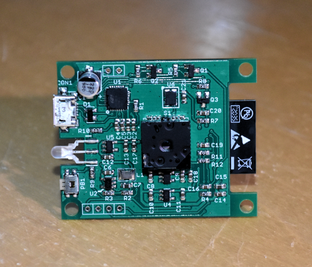
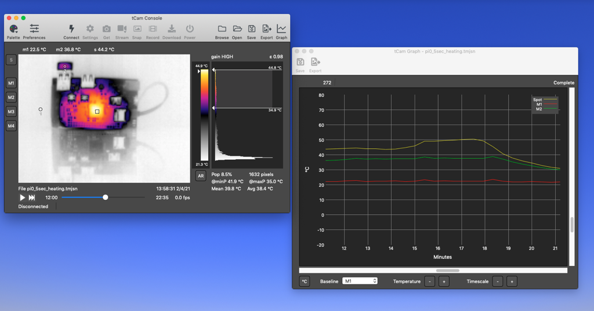
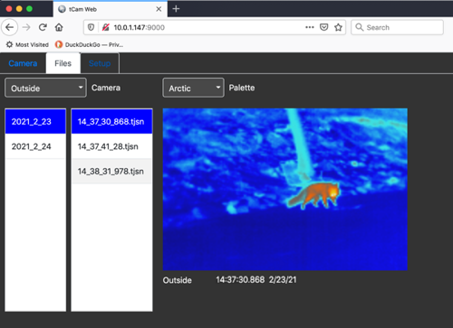

## ESP32-based Thermal Imaging Cameras
tCam and tCam-Mini are two cameras I designed around the ESP32 and Lepton 3.5.  They are designed to provide easy access to radiometric data from the Lepton.  Radiometric data is useful because it contains temperature information for each pixel in the camera's image allowing for all kinds of data analysis even if the image is stored to a file.

### tCam
tCam (still under development) is a full featured, battery powered camera with a local touchscreen display, local storage and a WiFi interface.

### tCam-Mini
tCam-Mini is a smaller network-only camera designed for streaming and remote access.

### Desktop Application
Both cameras share a common command set for remote access.  A companion Desktop computer application may be used to configure and access the cameras as well as perform some analysis.

### Web Server
A simple stand-alone server that can connect to multiple cameras, record images that meet certain criteria and display images from the cameras in a web browser.

### Python Driver
A simple driver to allow access from python programs.