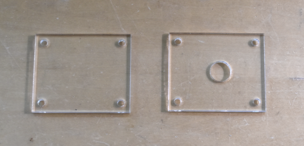
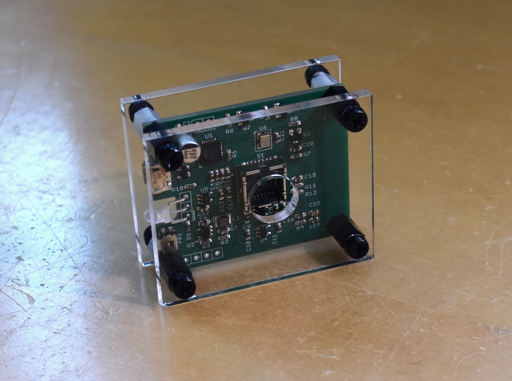
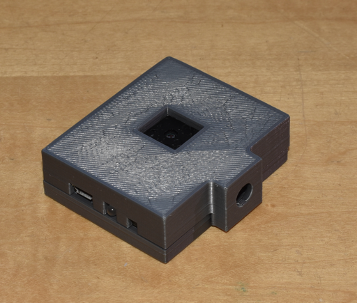

## tCam-Mini Enclosures

### Laser cut Front/Rear plates
A super-simple set of drawings suitable for a laser cutter in ```laser``` for a front and rear plate.  Designed to be mounted with plastic stand-offs (~8mm for the front and 5mm for the rear).  Works with either Rev 2 or Rev 4 PCBs.





### Zeke Gustafson's 3D printed case
tCam-mini buyer Zeke Gustafson designed a case for the Rev 2 PCB and graciously shared it with me to include here.  His design file and STL files suitable for slicing for a printer can be found in ```zeke_gustafson```.

It is designed to use a 1/4"-20 square nut (McMaster 94855A247) for tripod mounting and 4x #4 thread-forming screws for assembly (McMaster 96068A105).



