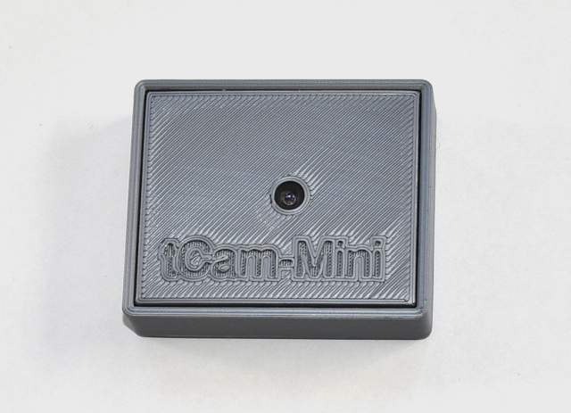
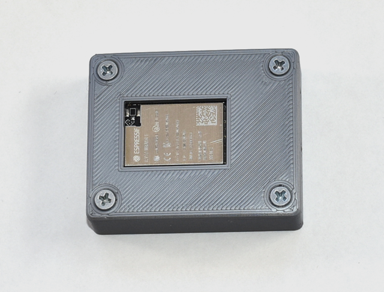
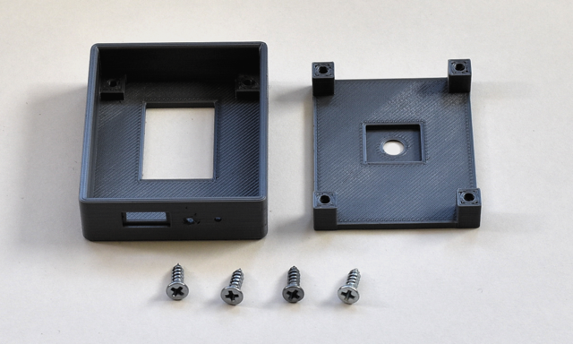
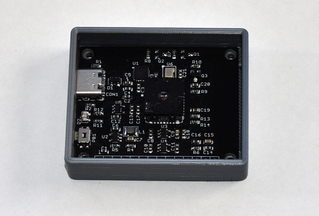
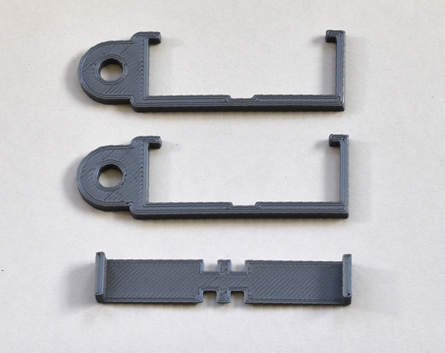
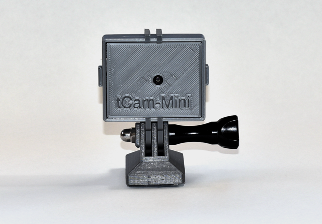
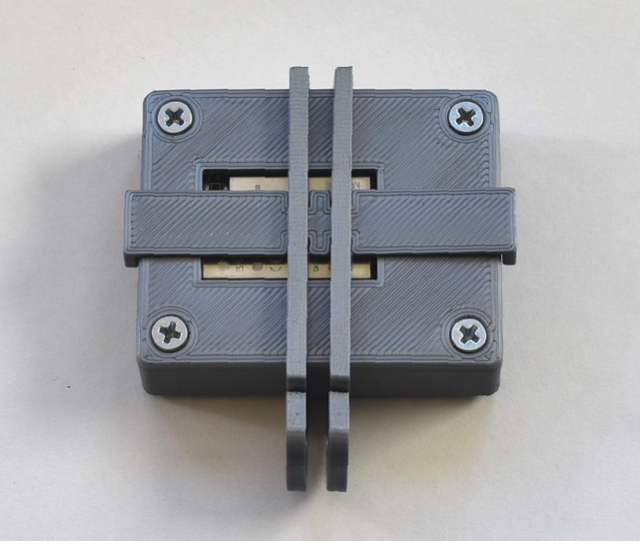

## tcam\_mini_basic

### Enclosure
The enclosure is comprised of two pieces, a base and a bezel.  There are two base designs.  One for the Rev 2 PCB (using the Micro-B USB connector) and one for the Rev 2 PB (using the USB C connector).  The bezel fits both bases.





The STL files are generated using the ```tcam_mini_basic_encl.scad``` [OpenSCAD](https://openscad.org/) source file.  These files may be sliced using your printer's configuration.

1. ```tcam_mini_bezel.stl``` - Enclosure bezel.
2. ```tcam_mini_rev2_encl.stl``` - Enclosure base for Rev 2 PCB based boards.
3. ```tcam_mini_rev4_encl.stl``` - Enclosure base for Rev 4 PCB based boards.

The enclosure is designed to be fastened together using 4 4-40 x 3/8" metal screws (or the M3 equivalent for the rest of the world).





### GoPro™ compatible mount
The mount is comprised of three pieces from two STL files.  Two vertical parts make the dual mounting flanges.  A horizontal part aligns them and holds the camera in place.  The vertical parts may be oriented so the camera is either above or below the mount.



The STL files are generated using the ```tcam_mini_gp_mount.scad``` source file.

1. ```tcam_mini_gp_mount_h.stl``` - Horizontal part (1x).
2. ```tcam_mini_gp_mount_v.stl``` - Vertical part (2x).


(Shown on base, not included here)



