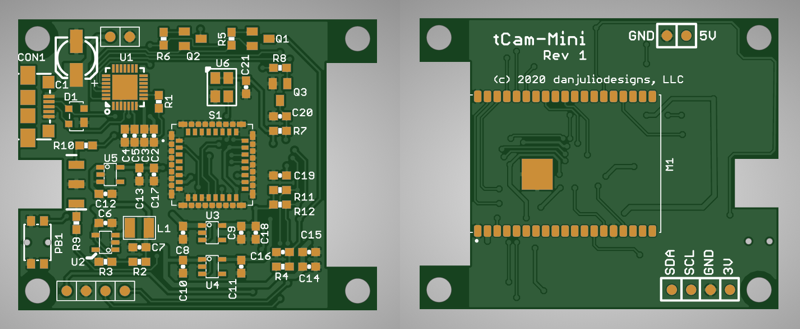
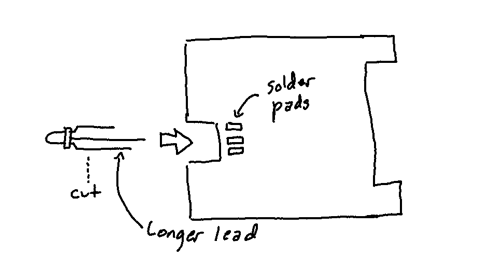

## tCam-Mini Hardware
This directory contains design files for tCam-Mini including PCB gerbers, stencil gerbers, a BOM and schematic.

### LED Orientation
The LED is aligned as shown below.  Lead length should be adjusted to fit an enclosure if desired or so the dome of the LED is beyond the edge of the PCB.

### Antenna Selection
You can choose to buy an ESP32 module with a built-in antenna or one with an IPEX (U.FL) connector for use with an external antenna.  I have found better performance using an external antenna.  I have listed both parts in the BOM along with a short cable and antenna I know to work.  Most 2.4 GHz WiFi antennas should be fine.

Here using an antenna that came with a Particle dev board.  It works fine.  I had previously cut off the mounting tabs to see if that improved performance of the built-in antenna.  It didn't really help.