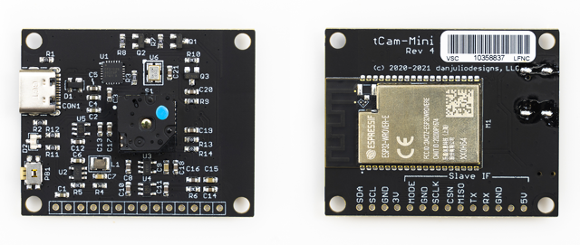
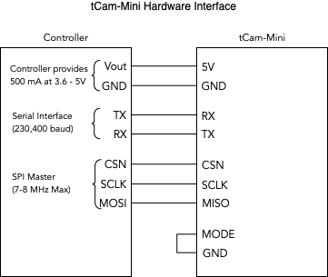
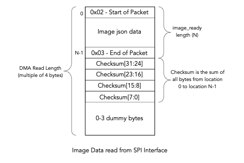
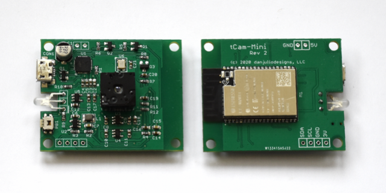
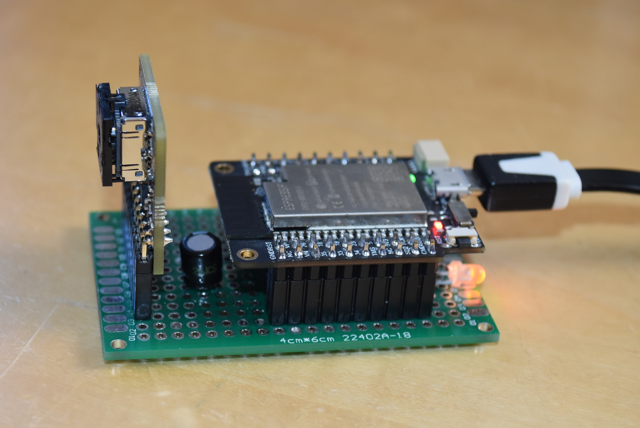
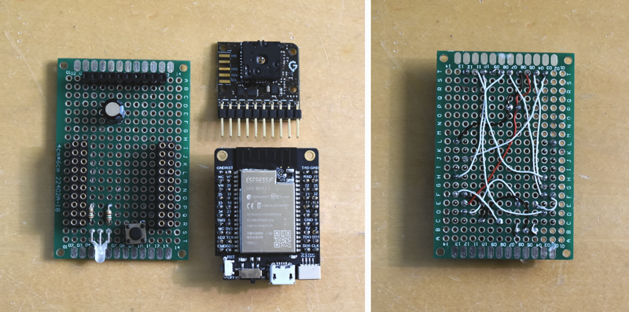
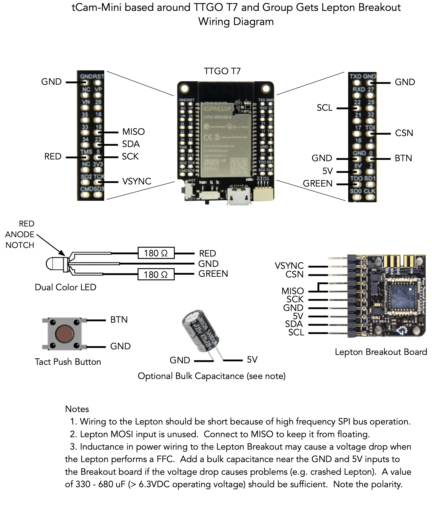

## tCam-Mini
tCam-Mini was created using code from the tCam project and ended up being finished first.  It is a simple device, hardware-wise, consisting of an ESP32 WROVER module, USB UART for programming and debug, Lepton 3.0/3.5 and supporting voltage regulators and oscillator.



(image courtesy of Group Gets)

Revision 4 of the PCB, along with FW 2.0, introduces a new hardware expansion port that can be used by an external micro-controller or single-board computer to communicate with tCam-Mini directly instead of using WiFi.  It also has an I2C expansion port that is currently unused, a USB-C connector and surface-mount LED.

### Firmware
The "Firmware" directory contains a V4.0.2 Espressif ESP32 IDF project for tCam-Mini. You should be able to build and load it into a camera using the IDF commands (I still use "make program monitor").  There are also a set of precompiled binaries in the "precompiled" sub-directory.  You can use the Espressif tool and instructions found in the "programming" directory in parallel to this one to load those into a camera without having to build the project.

Note: The precompiled firmware and Windows-based programming application can be downloaded directly from my [website](http://danjuliodesigns.com/products/tcam_mini.html) as well if you don't want to clone this entire repository.

#### FW 2.1 (2/5/2022)
FW revision 2.1 fixes the following issues.  It is designed to run on the tCam-Mini PCBs with Revision 3 silicon and 8 MB Flash memory (camera's built using Revision 1 silicon or less than 8 MB Flash memory should use FW revision 1.3).  It fixes an issue where setting a password of less than 8 characters would brick the tCam-Mini (requiring reload of firmware using the Windows utility).

1. Prevent updating Wifi password if the length is less than 8 characters to avoid a condition where the ESP32 wifi library fails on boot and the camera can't be reconfigured.
2. Add the ability to reset WiFi even when the camera has detected a hardware fault on boot (backup solution to #1 above).

#### FW 2.0 (11/23/2021)
FW revision 2.0 adds the following new features.  It is designed to run on the tCam-Mini PCBs with Revision 3 silicon and 8 MB Flash memory (camera's built using Revision 1 silicon or less than 8 MB Flash memory should use FW revision 1.3).

1. Faster performance - often reaching the full 8.7 fps over WiFi.
2. Support for Lepton 3.0.
3. Support for OTA FW updates (from the Desktop Application 2.0). It won’t be necessary to use the serial IF and Espressif utility to load new firmware releases after 2.0 is loaded.
4. Support for a new HW Slave interface (available on PCB revision 4) for direct connect to another Micro (I use this for tCam).

### Hardware
The "Hardware" directory contains PCB and stencil Gerber files, a BOM and a schematic PDF.  These can be used to build a tCam-Mini on the PCB I designed.  Of course you can also buy a pre-assembled unit from [Group Gets](https://store.groupgets.com/products/tcam-mini) with or without the Lepton.  See below for instructions on building one from commonly available development boards.

Note: My interests are in radiometric thermography so I have focused primarily on the Lepton 3.5.  The Lepton 3.0 is supported starting with FW 2.0.  It should be possible for someone to modify my firmware source to work with the Lepton 2 and 2.5 models by modifying the task that reads the lepton (probably easiest to modify the code that reads the data and then just pixel-double it before handing it off to other tasks).  I will be happy to include a link to anyone else's clone of my code that supports these older Leptons.

### Operation
tCam-Mini is a command-based device.  It is designed for software running on another device to control it and receive responses and image data from it.  The software communicates with tCam-Mini via one of two ways depending on the polarity of the Mode input at boot.

1. Mode bit left disconnected (pulled high) configures communication via WiFi using a socket interface with commands, responses and images encoded as json packets.  Data is not encrypted so appropriate care should be taken.
2. Mode bit low (grounded) configures communication via the Hardware Interface using a serial interface and a slave SPI interface.  Commands and responses are sent as json packets over the serial interface.  A new "image_ready" packet indicates that the controller can read an image from the SPI interface.

#### USB Port
The USB Port provides a USB Serial interface supporting automatic ESP32 reset and boot-mode entry for programming.  It is also used for serial logging output by the ESP32 firmware (115,200 baud).

#### Status Indicator
A dual-color (red/green) LED is used to communicate status.  Combinations of color and blinking patterns communicate various information.

| Status Indicator | Meaning |
| --- | --- |
| Off or Dim | Firmware did not start |
| Solid Red | Firmware is running: initializing and configuring the Lepton and WiFi (when configured to use WiFi)|
| Blinking Yellow | WiFi AP Mode : No client connected to camera's WiFi |
|  | WiFi Client Mode : Not connected to an AP |
| Solid Yellow | WiFi AP Mode : Client connected to camera'sWiFi |
|  | WiFi Client Mode : Connected to an AP |
| Solid Green | Wifi Mode : WiFi is connected and external software has connected via the socket interface|
|  | Hardware Interface Mode : Camera is ready for operation |
| Fast Blink Yellow | WiFi Reset in progress |
| Alternating Red/Green | Over-the-air FW update has been requested.  Press the button to initiate the update |
| Blinking Green | FW update in process |
| Series of Red Blinks | A fault has been detected.  The number of blinks indicate the fault type (see table below) |


| Fault Blinks | Meaning |
| --- | --- |
| 1 blink | ESP32 I2C or SPI peripheral initialization failed |
| 2 blinks | ESP32 Non-volatile storage or WiFi initialization failed |
| 3 blinks | ESP32 static memory buffer allocation failed (potential PSRAM issue) |
| 4 blinks | Lepton CCI communication failed (I2C interface) |
| 5 blinks | Lepton VoSPI communication failed (SPI interface) |
| 6 blinks | Internal network error occurred |
| 7 blinks | Lepton VoSPI synchronization cannot be achieved |
| 8 blinks | Over-the-air FW Update failed |

Additional start-up and fault information is available from the USB Serial interface.

#### WiFi
tCam-Mini can act as either an Access Point (creating its own WiFi network) or a client (connecting to an existing WiFi network).  WiFi is enabled when the Mode input is high (left floating) when tCam-Mini boots.  The camera acts as an Access Point (AP) by default.  It selects an SSID based on a unique MAC ID in the ESP32 with the form "tCam-Mini-HHHH" where "HHHH" are the last four hexadecimal digits of the MAC ID.  There is no password by default.  When acting as an Access Point, each tCam-Mini always has the same default IPV4 address (192.168.4.1).

It can be reconfigured via a command (for example, from the desktop application) to act as a WiFi Client (STAtion mode) and connect to an existing WiFi network.  When configured as a WiFi Client, it can either get a DHCP served address from the network's router or it can also be reconfigured to have a fixed (static) IPV4 address.  Using a static address makes it easier to connect to tCam-Mini because you don't have to find out what DHCP address the router gave it by logging into the router or using a utility like the Fing Android app or nmap on Linux.

Currently only one device can connect to the camera at a time.

Please see the set of instructions in the DesktopApp folder in this repository for connecting to tCam-Mini in either mode.

#### WiFi Reset Button
Pressing and holding the WiFi Reset Button for more than five seconds resets the WiFi interface back to the default AP mode.  The status indicator will blink a pattern indicating the reset has occurred (see below).

Pressing the button quickly when an OTA FW update has been requested (LED alternating red/green) by the Desktop application initiates the update process.

#### Hardware Interface
The hardware interface is enabled when the Mode input is low (grounded) when tCam-Mini boots.



The serial port (running at 230,400 baud) is used to send and receive commands and responses as described below.  Instead of sending an "image" response over the relatively slow serial port, the firmware sends an "image_ready" response to notify software running on the external system that it can read the image from the slave SPI port using a master SPI peripheral.

The slave SPI port is partially handled by a driver running on the ESP32.  For this reason the highest supported clock rate is 8 MHz.  Too fast and the ESP32 slave SPI driver can't keep up.  I found success running the interface at 7 MHz.


### Command Interface
The camera is capable of executing a set of commands and generating responses or sending image data when connected to a remote computer via one of the interfaces.  It can support one remote connection at a time.  Commands and responses are encoded as json-structured strings.  The command interface exists as a TCP/IP socket at port 5001 when using WiFi.

Each json command or response is delimited by two characters.  A Start delimiter (value 0x02) precedes the json string.  An End delimiter (value 0x03) follows the json string.  The json string may be tightly packed or may contain white space.

```<0x02><json string><0x03>```

The camera currently supports the following commands.  The communicating application should wait for a response from commands that generate one before issuing subsequent commands (although the camera command buffer is 12,288 bytes (sized for the ```fw_segment``` command) and can support multiple short commands).

| Command | Description |
| --- | --- |
| get_status | Returns a packet with camera status.  The application uses this to verify communication with the camera. |
| get_image | Returns a packet with metadata, radiometric (or AGC) image data and Lepton telemetry objects. |
| set_time | Set the camera's clock. |
| get_config | Returns a packet with the camera's current settings. |
| get\_lep_cci | Reads and returns specified data from the Lepton's CCI interface. |
| run_ffc | Initiates a Lepton Flat Field Correction. |
| set_config | Set the camera's settings. |
| set\_lep_cci | Writes specified data to the Lepton's CCI interface. |
| set_spotmeter | Set the spotmeter location in the Lepton. |
| stream\_on | Starts the camera streaming images and sets the interval between images and an optional number of images to stream. |
| sstream\_off | Stops the camera from streaming images. |
| get_wifi | Returns a packet with the camera's current WiFi and Network configuration. |
| set_wifi | Set the camera's WiFi and Network configuration.  The WiFi subsystem is immediately restarted.  The application should immediately close its socket after sending this command. |
| fw\_update_request | Informs the camera of a OTA FW update size and revision and starts it blinking the LED alternating between red and green to signal to the user a OTA FW update has been requested. |
| fw\_segment | Sends a sequential chunk of the new FW during an OTA FW update. |

The camera generates the following responses.

| Response | Description |
| --- | --- |
| cam_info | Generic information packet from the camera.  Status for commands that do not generate any other response.  May also contain alert or error messages from the camera. |
| cci_reg | Response to both get\_cci\_reg and set\_cci\_reg commands. |
| config | Response to get_config command. |
| get_fw | Request a sequential chunk of the new FW during an OTA FW update. |
| image | Response to get_image command or initiated periodically by the camera if streaming has been enabled. |
| status | Response to get_status command. |
| wifi | Response to get_wifi command. |

Commands and responses are detailed below with example json strings.

#### get_status
```{"cmd":"get_status"}```

#### get_status response
```
{
	"status": {
		"Camera":"tCam-Mini-EFB5",
		"Model":262402,
		"Version":"2.0",
		"Time":"17:33:49.0",
		"Date":"2/3/21"
	}
}
```
The get_status response may include additional information for other camera models (for example Battery/Charge information).

| Status Item | Description |
| --- | --- |
| Camera | AP SSID also used as the camera name. |
| Model | A 32-bit mask with camera information (see below). Software can use the camera model to enable and disable camera specific functionality. |
| Version | Firmware version. "Major Revision . Minor Revision" |
| Time | Current Camera Time including milliseconds: HH:MM:SS.MSEC |
| Date | Current Camera Date: MM/DD/YY |

| Model Bit | Description |
| --- | --- |
| 31:19 | Reserved - Read as 0 |
| 18 | Supports over-the-air FW updates |
| 17 | Has Filesystem Flag |
| 16 | Has Battery Flag |
| 15:9 | Reserved - Read as 0 |
| 8 | Non-radiometric Lepton installed (FW 2.0 and beyond) |
| 7:0 | Camera Model Number - tCam-Mini reports 2 when using the WiFI interface and 3 when using the Hardware interface |

#### get_image
```{"cmd":"get_image"}```

#### [WiFi only] get_image response (or initiated periodically while streaming)
```
{
	"metadata":	{
		"Camera": "tCam-Mini-EFB5",
		"Model": 2,
		"Version": "1.0",
		"Time": "19:00:58.644",
		"Date": "2/3/21"
	},
	"radiometric": "I3Ypdg12B3YPdgt2BXYRdgF2A3YFdgF2AXYNdv91+3ULdvd..."
	"telemetry": "DgCDMSkAMAgAABBhCIKyzJpkj..."
}
```

| Image Item | Description |
| --- | --- |
| metadata | Camera status information at the time the image was acquired. |
| radiometric | Base64 encoded Lepton pixel data (19,200 16-bit words / 38,400 bytes).  Each pixel contains a 16-bit absolute (Kelvin) temperature value when the Lepton is operating in Radiometric output mode.  The Lepton's gain mode specifies the resolution (0.01 K in High gain, 0.1 K in Low gain). Each pixel contains an 8-bit value when the Lepton has AGC enabled. |
| telemetry | Base64 encoded Lepton telemetry data (240 16-bit words / 480 bytes).  See below for some important telemetry words and the Lepton Datasheet for a full description of the telemetry contents. |

#### [Hardware Interface only] image_ready response (or initiated periodically while streaming)
```{"image_ready": 51980}```

The ```image_ready``` response indicates that an image is available to read from the slave SPI interface.  The value indicates the number of bytes in the image, including the start and end delimiters. It is followed by a 4 byte checksum and 0-3 dummy bytes.  The dummy bytes may be necessary since the SPI read length must be a multiple of 4 bytes.  The SPI read must be a single operation and the image must be read from the slave SPI interface before another image will be sent.  For FW 2.0 and 2.1, the camera's response process hangs until the image is read.  Subsequent firmware releases timeout and discard the image after one second.



The checksum is simply the 32-bit sum of all ```image_ready``` response bytes with the high byte first.  It is used to validate that the SPI transfer successfully sent all bytes.  On occasion the ESP32 slave SPI driver may fail to keep up and the checksum is used to discard corrupt images.

#### get\_lep_cci
```
{
  "cmd": "get_lep_cci",
  "args": {
    "command": 20172,
    "length": 4
  }
}
```

| get\_lep_cci argument | Description |
| --- | --- |
| command | Decimal representation of the 16-bit Lepton COMMAND register value. For example, the value "20172" above is 0x4ECC (RAD Spotmeter Region of Interest). |
| length | Decimal number of 16-bit words to read (1-512). |

#### cci\_reg response (for get\_lep_cci)
```
{
  "cci_reg": {
    "command":20172,
    "length":4,
    "status":6,
    "data":"OwBPADwAUAA="
  }
}
```

| cci_reg Item | Description |
| --- | --- |
| command | Decimal representation of the 16-bit Lepton COMMAND register value read. |
| length | Decimal number of 16-bit words read. |
| status | Decimal representation of the 16-bit Lepton STATUS register with the final status of the read. |
| data | Base64 encoded Lepton register data. ```length``` 16-bit words.  For length <= 16 the data is from the Data Register 0 - 15.  For length > 16 the data is from Block Data Buffer 0. |

#### set_time
```
{
  "cmd": "set_time",
  "args": {
    "sec": 14,
    "min": 10,
    "hour": 21,
    "dow": 2,
    "day": 18,
    "mon": 5,
    "year": 50
  }
}
```
All set_time args must be included.

| set_time argument | Description |
| --- | --- |
| sec | Seconds 0-59 |
| min | Minutes 0-59 |
| hour | Hour 0-23 |
| dow | Day of Week starting with Sunday 1-7 |
| day | Day of Month 1-28 to 1-31 depending |
| mon | Month 1-12 |
| year | Year offset from 1970 |

#### get_config
```{"cmd":"get_config"}```

#### get_config response
```
{
	"config":{
		"agc_enabled":0,
		"emissivity":100,
		"gain_mode":0
	}
}
```

| Status Item | Description |
| --- | --- |
| agc_enabled | Lepton AGC Mode: 1: Enabled, 0: Disabled (Radiometric output) |
| emissivity | Lepton Emissivity: 1 - 100 (integer percent) |
| gain_mode | Lepton Gain Mode: 0: High, 1: Low, 2: Auto |

#### run_ffc
```{"cmd":"run_ffc"}```

#### cam\_info response for run_ffc
```
{
  "cam_info": {
    "info_value": 1,
    "info_string": "run_ffc success"
  }
}
```

#### set_config
```
{
  "cmd": "set_config",
  "args": {
    "agc_enabled": 1,
    "emissivity": 98,
    "gain_mode": 2
  }
}
```
Individual args values may be left out.  The camera will use the existing value.

| set_config argument | Description |
| --- | --- |
| agc_enabled | Lepton AGC Mode: 1: Enabled, 0: Disabled (Radiometric output) |
| emissivity | Lepton Emissivity: 1 - 100 (integer percent) |
| gain_mode | Lepton Gain Mode: 0: High, 1: Low, 2: Auto |

```set_config``` items are stored in non-volatile flash memory for cameras operating with WiFi enabled, allowing them to persist across power cycles.  They are not stored in non-volatile memory for cameras operating with the Hardware Interface enabled and only persist until power is removed.  It is assumed the host device will configure the desired items during an initialization sequence.

#### set\_lep_cci
```
{
  "cmd":"set_lep_cci",
  "args": {
    "command":20173,
    "length":4,
    "data":"OwBPADwAUAA="
  }
}
```

| set\_cci_reg argument | Description |
| --- | --- |
| command | Decimal representation of the 16-bit Lepton COMMAND register value.  Note bit 0 must be set for a write. |
| length | Decimal number of 16-bit words written. |
| data | Base64 encoded Lepton register data to write. ```length``` 16-bit words.  For length <= 16 the data will be loaded into the Data Registers.  For length > 16 the data will be loaded into Block Data Buffer 0. |

Note: It is possible to crash the Lepton or camera using the CCI interface.

#### cci\_reg response (for set\_lep_cci)
```
{
  "cci_reg": {
    "command":20173,
    "length":4,
    "status":6
  }
}
```

| cci_reg Item | Description |
| --- | --- |
| command | Decimal representation of the 16-bit Lepton COMMAND register value.  Note bit 0 will be set for a write. |
| length | Decimal number of 16-bit words written. |
| status | Decimal representation of the 16-bit Lepton STATUS register with the final status of the write. |

#### set_spotmeter
```
{
  "cmd": "set_spotmeter",
  "args": {
    "c1": 79,
    "c2": 80,
    "r1": 59
    "r2": 60
  }
}
```

| set_spotmeter argument | Description |
| --- | --- |
| c1 | Spotmeter column 1: Left X-axis spotmeter box coordinate (0-159) |
| c2 | Spotmeter column 2: Right X-axis spotmeter box coordinate (0-159) |
| r1 | Spotmeter row 1: Top Y-axis spotmeter box coordinate (0-119) |
| r2 | Spotmeter row 2: Bottom Y-axis spotmeter box coordinate (0-119) |

Column c1 should be less than or equal to c2.  Row r1 should be less than or equal to r2.  All four argument values must be specified.  They specify the box of pixels the Lepton uses to calculate the spotmeter temperature (which is contained in the image telemetry).

#### stream\_on
```
{
	"cmd":"stream_on",
	"args":{
		"delay_msec":0,
		"num_frames":0
	}
}
```

| stream\_on argument | Description |
| --- | --- |
| delay_msec | Delay between images.  Set to 0 for fastest possible rate.  Set to a number greater than 250 to specify the delay between images in mSec. |
| num_frames | Number of frames to send before ending the stream session.  Set to 0 for no limit (set\_stream_off must be send to end streaming). |

Streaming is a slightly special case for the command interface.  Responses are typically generated after receiving the associated get command.  However the image response is generated repeatedly by the camera after streaming has been enabled at the rate, and for the number of times, specified in the set\_stream\_on command.

#### stream\_off
```{"cmd":"stream_off"}```

#### get_wifi
```{"cmd":"get_wifi"}```

#### get_wifi response
```
{
  "wifi": {
    "ap_ssid": "tCam-Mini-EFB5",
    "sta_ssid": "HomeNetwork",
    "flags": 143,
    "ap_ip_addr": "192.168.4.1",
    "sta_ip_addr": "10.0.1.144",
    "sta_netmask":"255.255.255.0"
    "cur_ip_addr": "10.0.1.144"
  }
}
```

| Response | Description |
| --- | --- |
| ap_ssid | The camera's current AP-mode SSID and also the camera name as reported in the metadata and status packets. |
| sta_ssid | The SSID used when the camera's WiFi is configured as a client (STAtion mode) |
| flags | 8-bit Wifi Status as a decimal number (see below). |
| ap\_ip_addr | The camera's IP address when it is in AP mode. |
| sta\_ip_addr | The static IP address to use when the camera is a client and configured to use a static IP. |
| sta_netmask | The netmask to use when the camera is a client and configured to use a static IP. |
| cur\_ip_addr | The camera's current IP address.  This may be a DHCP served address if the camera is configured in Client mode with static IP addresses disabled. |

Password information is not sent as part of the wifi response.

| Flag Bit | Description |
| --- | --- |
| 7 | Client Mode - Set to 1 for Client Mode, 0 for AP mode. |
| 6:5 | Unused, will be set to 0. |
| 4 | Static IP - Set to 1 to use a Static IP, 0 to request an IP via DHCP. |
| 3 | Bit 3: Wifi Connected - Set to 1 when connected to another device. |
| 2 | Wifi Client Running - Set to 1 when the client has been started, 0 when disabled (obviously this bit will never be 0). |
| 1 | Wifi Initialized - Set to 1 when the WiFi subsystem has been successfully initialized (obviously this bit will never be 0). |
| 0 | Bit 0: Wifi Enabled - Set to 1 when Wifi has been enabled, 0 when Wifi has been disabled. |

#### set_wifi
```
{
  "cmd": "set_wifi",
  "args": {
    "ap_ssid": "ANewApName"
    "ap_pw: "apassword"
    "ap_ip_addr": "192.168.4.1",
    "flags": 145,
    "sta_ssid": "HomeNetwork",
    "sta_pw": "anotherpassword",
    "sta_ip_addr": "10.0.1.144",
    "sta_netmask": "255.255.255.0"
  }
}
```

Individual args values may be left out (for example to just set AP or Client (STA) values.  The camera will use the existing value.

| set_wifi argument | Description |
| --- | --- |
| ap_ssid | Set the AP-mode SSID and also the camera name as reported in the metadata and status objects. |
| ap_pw | Set the AP-mode password. |
| ap\_ip_addr | The camera's IP address when it is in AP mode. |
| flags | Set WiFi configuration (see below). |
| sta_ssid | Set the client-mode (STA) SSID. |
| sta_pw | Set the client-mode (STA) password. |
| sta\_ip_addr | Set the static IP address to use when the camera as a client and configured to use a static IP. |
| sta_netmask | Set the netmask to use when the camera as a client and configured to use a static IP. |

Only a subset of the flags argument are used to configure WiFi operation.  Other bit positions are ignored.

| Flag Bit | Description |
| --- | --- |
| 7 | Client Mode - Set to 1 for Client mode, 0 for AP mode. |
| 4 | Static IP - Set to 1 to use a Static IP, 0 to request an IP via DHCP when operating in Client mode. |
| 0 | Bit 0: Wifi Enabled - Set to 1 to enable Wifi, 0 to disable Wifi. |

The command will fail if an SSID is zero length or greater than 32 characters or if a password is less than 8 characters or greater than 32 characters.

Although I do not recommend it, use the following procedure to set a zero-length (null) password.

1. Reset the Wifi configuration using the Wifi reset button.  This sets all password fields to a null value.
2. Use the Desktop application to configure the Wifi but make sure the password field is not updated (de-select the Update checkbox).  Alternatively send a set_wifi command without a password (```ap_pw``` or ```sta_pw``` argument). 

#### cam_info messages
The ```cam_info``` response is generated for commands that do not return a response such as ```set_clock```, ```set_config``` or ```set_wifi``` with status about the success or failure of the command.  It can also be generated by the camera for certain errors.

For example, ```cam_info``` for ```set_clock``` looks like.

```
{
  "cam_info": {
    "info_value": 1,
    "info_string": "set_clock success"
  }
}
```

| cam_info Item | Description |
| --- | --- |
| info_value | A decimal status code (see below). |
| info_string | An information string. |

| cam_info status code | Description |
| --- | --- |
| 0 | Command NACK - the command failed.  See the information string for more information. |
| 1 | Command ACK - the command succeeded. |
| 2 | Command unimplemented - the camera firmware does not implement the command. |
| 3 | Command bad - the command was incorrectly formatted or was not a json string. |
| 4 | Internal Error - the camera detected an internal error.  See the information string for more information. |
| 5 | Debug Message - The information string contains an internal debug message from the camera (not normally generated). |

#### fw\_update_request
The ```fw_update_request``` command initiates the FW update process.

```
{
  "cmd":"fw_update_request",
  "args":{"length":730976,"version":"2.0"}
}
```

All arguments are required.

| fw\_update_request argument | Description |
| --- | --- |
| length | Length of binary file in bytes. |
| version | Binary file version.  This must match the build version embedded in the binary file. |

#### get_fw
The camera requests a chunk of the binary file using the ```get_fw``` response after the user has initiated the update.  Currently the camera will request a maximum of 8192 bytes.

```
{
  "get_fw":{
    "start":0,
    "length":8192
  }
}
```

| get_fw argument Item | Description |
| --- | --- |
| start | Starting byte of the current chunk (offset into binary file). |
| length | Number of bytes to send in a subsequent ```fw_segment```. |

#### fw_segment
Generated in response to a ```get_fw``` request.  Must always use the arguments in the ```get_fw``` request.

```
{
  "cmd":"fw_segment",
  "args":{
    "start":0,
    "length":8192,
    "data":"6QYCMPwUCEDuAAAAAAADAAAAAAAAAAABIABAPwjEAQAyVM2rAAAAAAAAA..."
  }
}
```

| fw_segment Argument | Description |
| --- | --- |
| start | Starting byte of current chunk. |
| length | Length of chunk in bytes. |
| data | Base64 encoded binary data chunk. |
 
### OTA FW Update Process
The OTA FW update process consists of several steps.  The FW is contained in the binary file ```tCamMini.bin``` in the precompiled FW directory or built using the Espressif IDF.  No other binary files are required.

1. An external computer initiates the update process by sending a ```fw_update_request```.
2. The camera starts blinking the LED in an alternating red/green pattern to indicate a FW update has been requested.  The user must press the Wifi Reset Button to confirm the update should proceed.
3. The camera sends a ```get_fw``` to request a chunk of data from the computer.
4. The computer sends a ```fw_segment``` with the requested data.
5. Steps 3 and 4 are repeated until the entire firmware binary file has been transferred.
6. The camera validates the binary file and sends a ```cam\_info``` indicating if the update is successful or has failed.  If successful the camera then reboots into the new firmware.

### Important Telemetry Locations

| Offset | 16-bit Word Description |
| --- | --- |
| 3 | Status Low (see below) |
| 4 | Status High |
| 99 | Emissivity (scaled by 8192) |
| 208 | TLinear Enabled Flag - 0 = disabled, 1 = enabled |
| 209 | TLinear Resolution Flag - 0 = 0.1, 1 = 0.01 |
| 210 | Spot Meter Mean - 16-bit radiometric value |
| 214 | Spot Meter Y1 coordinate |
| 215 | Spot Meter X1 coordinate |
| 216 | Spot Meter Y2 coordinate |
| 217 | Spot Meter X2 coordinate |


| Bit | Status Bit Description |
| --- | --- |
| 20 | Over Temperature Shut Down imminent (shutdown in 10 seconds) |
| 15 | Shutter Lockout - 0 = not locked out, 1 = locked out (outside of valid operating temperature range -10°C to 80°C) |
| 12 | AGC State - 0 = disabled, 1 = enabled |
| 5:4 | FFC State - 0 = Not commanded, 1 = Imminent, 2 = Running, 3 = Complete |
| 3 | FFC Desired |

#### Using telemetry data

The Status AGC State bit indicates the form of the pixel data.  When AGC is enabled the lepton performs a histogram analysis of the data and the pixel data is 8-bits (low byte of each 16-bit word) designed to directly index a palette array for display.  When AGC is disabled the lepton outputs 16-bit radiometric data in each pixel.  This data represents the actual temperature of each pixel in degrees Kelvin scaled by either 10 (TLinear Resolution Flag = 0) or 100 (TLinear Resolution Flag = 1).  The TLinear Resolution Flag indicates the gain mode of the Lepton (0 = Low Gain, 1 = High Gain).

The radiometric pixel temperature in °C may be computed using the following formula where TLinear resolution is 0.1 if TLinear Resolution Flag is 0 and 0.01 if TLinear Resolution Flag is 1.

``` TempC = Pixel[15:0] * TLinear_resolution - 273.15```

The Spot Meter average temperature value is computed using the same formula, substituting the Spot Meter Mean for pixel data, and is valid independent of AGC enabled or disabled.  The Spot Meter is the average value of the pixels in the box defined by the Spot Meter (X1, Y1) and (X2, Y2) coordinates.

The FFC State may be used to identify when the lepton is preparing to perform a FFC (flat field correction) and is performing a FFC.  While performing a FFC the lepton closes the shutter in front of the sensor array.  Image data is not available while a FFC is being performed.

### Previous version


### Building with dev boards
A board like the [TTGO T7 V1.4](http://www.lilygo.cn/prod_view.aspx?TypeId=50033&Id=978&FId=t3:50033:3) ESP32 WROVER based development board is a way, along with a [Lepton Breakout](https://store.groupgets.com/products/purethermal-breakout-board) from Group Gets, to hand build a tCam-Mini.

You can use other ESP32 development boards, just make sure they have a PSRAM chip built-in (WROVER-based).



You'll also need the following components.

* Small proto board to build on.  I used a commonly available 4x6cm board.
* 5 10-pin 0.1" headers (4 for the TTGO V7 and 1 for the Lepton Breakout).
* A small tactile push button.
* A dual Red-Green common-cathode LED (I use a Lite-On LTL1BEKVJNN).
* Two 180-330 ohm resistors, 1/8 - 1/4 watt.
* Optional electrolytic capacitor.  This should only be necessary if there is a voltage drop when the Lepton performs a FFC causing it to malfunction due to inductance in the hand wiring.

The components are wired together as shown below.





#### ESP32 Connections

| ESP32 GPIO | Connection |
| --- | --- |
|  0 | Button |
|  5 | Lepton SPI SCK |
| 12 | Lepton SPI CSN |
| 13 | Lepton Vsync |
| 14 | Red LED Anode |
| 15 | Green LED Anode |
| 19 | Lepton SPI MISO |
| 22 | Lepton I2C SCL |
| 23 | Lepton I2C SDA |

#### ESP Revision / Module Notes
The modules I buy from Mouser and that Group Gets sources for the PCB design include a Rev 3 ESP32 chip and I compile for that version.  Some dev boards may include a module with a Rev 1 ESP32.  For these modules you must use the version 1.6 firmware.  Modules with a Rev 3 ESP32 may use the latest firmware.  The binary files for each revision can be found in the firmware/precompiled subdirectory.  The camera won't boot if you use the wrong chip revision.

The PCB versions have 8 MB Flash modules (64 MBit) but the TTGO module is typically 4 MB (32 MBit).  Be sure to properly configure the flash size in the programmer to match your module or the firmware will fail to boot.  This is explained in the programming sub-directory readme.

To enable OTA updates the module must have at least 8 MB of Flash memory.  Modules with 4 MB of Flash can be programmed using the Espressif download tool but cannot be updated using OTA transfers.