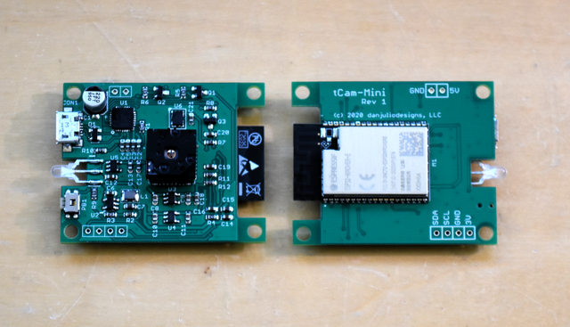
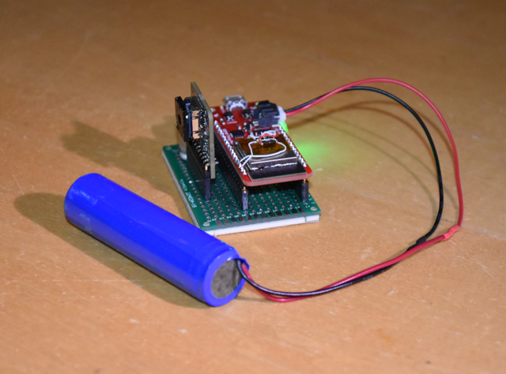

## tCam-Mini
tCam-Mini was created using code from the tCam project and ended up being finished first.  It is a simple device, hardware-wise, consisting of an ESP32 WROVER module, USB UART for programming and debug, Lepton 3.5 and supporting voltage regulators and oscillator.



It has a I2C expansion port that I intend to use to explore adding additional sensing capability such as humidity, distance and lens temperature to increase the camera's accuracy.

### Firmware
The "Firmware" directory contains a V4.0.2 Espressif ESP32 IDF project for tCam-Mini. You should be able to build and load it into a camera using the IDF commands (I still use "make program monitor").  There are also a set of precompiled binaries in the "precompiled" sub-directory.  You can use the Espressif tool and instructions found in the "programming" directory in parallel to this one to load those into a camera without having to build the project.

### Hardware
The "Hardware" directory contains PCB gerbers, stencil gerbers, a BOM and a schematic PDF.  These can be used to build a tCam-Mini on the PCB I designed.  See below for instructions on building one from commonly available development boards.

### Operation
tCam-Mini is a command-based device.  It is designed for software running on another device to control it and receive responses and image data from it.  The software communicates with tCam-Mini via a socket interface with commands, responses and images encoded as json packets.  Data is not encrypted so appropriate care should be taken.

#### USB Port
The USB Port provides a USB Serial interface supporting automatic ESP32 reset and boot-mode entry for programming.  It is also used for serial logging output by the ESP32 firmware (115,200 baud).

#### WiFi
tCam-Mini acts as an Access Point by default.  It selects an SSID based on a unique MAC ID in the ESP32 with the form "tCam-Mini-HHHH" where "HHHH" are the last four hexadecimal digits of the MAC ID.  There is no password by default.  When acting as an Access Point, each tCam-Mini always has the same default IPV4 address (192.168.4.1).

It can be reconfigured via a command to act as a WiFi Client (STAtion mode) and connect to an existing WiFi network.  It can also be reconfigured to have either a DHCP served IPV4 address or a fixed IPV4 address.

Currently only one device can connect to the camera at a time.

#### WiFi Reset Button
Pressing and holding the WiFi Reset Button for more than five seconds resets the WiFi interface back to the default AP mode.  The status indicator will blink a pattern indicating the reset has occurred.

#### Status Indicator
A dual-color (red/green) LED is used to communicate status.  Combinations of color and blinking patterns communicate various information.

| Status Indicator | Meaning |
| --- | --- |
| Off or Dim | Firmware did not start |
| Solid Red | Firmware is running: initializing and configuring the Lepton and WiFi |
| Blinking Yellow | AP Mode : No client connected to camera's WiFi |
|  | STA Mode : Not connected to an AP |
| Solid Yellow | AP Mode : Client connected to camera'sWiFi |
|  | STA Mode : Connected to an AP |
| Solid Green | WiFi is connected and external software has connected via a socket |
| Fast Blink Yellow | WiFi Reset in progress |
| Series of Red Blinks | A fault has been detected.  The number of blinks indicate the fault type (see table below) |


| Fault Blinks | Meaning |
| --- | --- |
| 1 blink | ESP32 I2C or SPI peripheral initialization failed |
| 2 blinks | ESP32 Non-volatile storage or WiFi initialization failed |
| 3 blinks | ESP32 static memory buffer allocation failed (potential PSRAM issue) |
| 4 blinks | Lepton CCI communication failed (I2C interface) |
| 5 blinks | Lepton VoSPI communication failed (SPI interface) |
| 6 blinks | Internal network error occurred |
| 7 blinks | Lepton VoSPI synchronization cannot be achieved |

Additional start-up and fault information is available from the USB Serial interface.

### Command Interface
The camera is capable of executing a set of commands and generating responses or sending image data when connected to a remote computer via the WiFi interface.  It can support one remote connection at a time.  Commands and responses are encoded as json-structured strings.  The command interface exists as a TCP/IP socket at port 5001.

Each json command or response is delimited by two characters.  A start delimitor (value 0x02) preceeds the json string.  A end delimitor (value 0x03) follows the json string.  The json string may be tightly packed or may contain white space.  However no command may exceed 256 bytes in length.

```<0x02><json string><0x03>```

The camera currently supports the following commands.  The communicating application should wait for a response from commands that generate one before issuing subsequent commands (although the camera does have some buffering - 1024 bytes - for multiple commands).

| Command | Description |
| --- | --- |
| get_status | Returns a packet with camera status.  The application uses this to verify communication with the camera. |
| get_image | Returns a packet with metadata, radiometric (or AGC) image data and Lepton telemetry objects. |
| set_time | Set the camera's clock.  Does not return anything. |
| get_config | Returns a packet with the camera's current settings. |
| set_config | Set the camera's settings.  Does not return anything. |
| set_spotmeter | Set the spotmeter location in the Lepton.  Does  not return anything. |
| set\_stream_on | Starts the camera streaming images and sets the interval between images and an optional number of images to stream.  Does not return anything but the camera will start generating image responses. |
| set\_stream_off | Stops the camera from streaming images. |
| get_wifi | Returns a packet with the camera's current WiFi and Network configuration. |
| set_wifi | Set the camera's WiFi and Network configuration.  The WiFi subsystem is immediately restarted.  The application should immediately close its socket after sending this command.  Does not return anything. |

The camera generates the following responses.

| Response | Description |
| --- | --- |
| config | Response to get_config command. |
| image | Response to get_image command or initiated periodically by the camera if streaming has been enabled. |
| status | Response to get_status command. |
| wifi | Response to get_wifi command. |

Commands and responses are detailed below with example json strings.

#### get_status
```{"cmd":"get_status"}```

#### get_status response
```
{
	"status": {
		"Camera":"tCam-Mini-EFB5",
		"Model":2,
		"Version":"1.0",
		"Time":"17:33:49.0",
		"Date":"2/3/21"
	}
}
```

| Status Item | Description |
| --- | --- |
| Camera | AP SSID also used as the camera name. |
| Model | tCam-Mini identifies with "2".  Software can use the camera model to enable and disable camera specific functionality. |
| Version | Firmware version. "Major Revision . Minor Revision" |
| Time | Current Camera Time including milliseconds: HH:MM:SS.MSEC |
| Date | Current Camera Date: MM/DD/YY |

#### get_image
```{"cmd":"get_image"}```

#### get_image response (or initiated while streaming)
```
{
	"metadata":	{
		"Camera":	"tCam-Mini-EFB5",
		"Model":	2,
		"Version":	"1.0",
		"Time":	"19:00:58.644",
		"Date":	"2/3/21"
	},
	"radiometric": "I3Ypdg12B3YPdgt2BXYRdgF2A3YFdgF2AXYNdv91+3ULdvd..."
	"telemetry": "DgCDMSkAMAgAABBhCIKyzJpkj..."
}
```

| Image Item | Description |
| --- | --- |
| metadata | Camera status information at the time the image was acquired. |
| radiometric | Base64 encoded Lepton pixel data. 19,200 16-bit words (38,400 bytes).  Each pixel contains a 16-bit absolute (Kelvin) temperature value when the Lepton is operating in Radiometric output mode.  The Lepton's gain mode specifies the resolution (0.01 K in High gain, 0.1 K in Low gain). Each pixel contains an 8-bit value when the Lepton has AGC enabled. |
| telmetry | Base64 encoded Lepton telemetry data.  240 16-bit words (480 bytes).  See the Lepton Datasheet for a description of the telemetry contents. |

#### set_time
```
{
  "cmd": "set_time",
  "args": {
    "sec": 14,
    "min": 10,
    "hour": 21,
    "dow": 2,
    "day": 18,
    "mon": 5,
    "year": 50
  }
}
```
All set_time args must be included.

| set_time argument | Description |
| --- | --- |
| sec | Seconds 0-59 |
| min | Minutes 0-59 |
| hour | Hour 0-23 |
| dow | Day of Week starting with Sunday 1-7 |
| day | Day of Month 1-28 to 1-31 depending |
| mon | Month 1-12 |
| year | Year offset from 1970 |

#### get_config
```{"cmd":"get_config"}```

#### get_config response
```
{
	"config":{
		"agc_enabled":0,
		"emissivity":100,
		"gain_mode":0
	}
}
```

| Status Item | Description |
| --- | --- |
| agc_enabled | Lepton AGC Mode: 1: Enabled, 0: Disabled (Radiometric output) |
| emissivity | Lepton Emissivity: 1 - 100 (integer percent) |
| gain_mode | Lepton Gain Mode: 0: High, 1: Low, 2: Auto |

#### set_config
```
{
  "cmd": "set_config",
  "args": {
    "agc_enabled": 1,
    "emissivity": 98,
    "gain_mode": 2
  }
}
```
Individual args values may be left out.  The camera will use the existing value.

| set_config argument | Description |
| --- | --- |
| agc_enabled | Lepton AGC Mode: 1: Enabled, 0: Disabled (Radiometric output) |
| emissivity | Lepton Emissivity: 1 - 100 (integer percent) |
| gain_mode | Lepton Gain Mode: 0: High, 1: Low, 2: Auto |

#### set_spotmeter
```
{
  "cmd": "set_spotmeter",
  "args": {
    "c1": 79,
    "c2": 80,
    "r1": 59
    "r2": 60
  }
}
```

| set_spotmeter argument | Description |
| --- | --- |
| c1 | Spotmeter column 1: Left X-axis spotmeter box coordinate (0-159) |
| c2 | Spotmeter column 2: Right X-axis spotmeter box coordinate (0-159) |
| r1 | Spotmeter row 1: Top Y-axis spotmeter box coordinate (0-119) |
| r2 | Spotmeter row 2: Bottom Y-axis spotmeter box coordinate (0-119) |

Column c1 should be less than or equal to c2.  Row r1 should be less than or equal to r2.  All four argument values must be specified.  They specify the box of pixels the Lepton uses to calculate the spotmeter temperature (which is contained in the image telemetry).

#### set\_stream_on
```
{
	"cmd":"stream_on",
	"args":{
		"delay_msec":0,
		"num_frames":0
	}
}
```

| set\_stream_on argument | Description |
| --- | --- |
| delay_msec | Delay between images.  Set to 0 for fastest possible rate.  Set to a number greater than 250 to specify the delay between images in mSec. |
| num_frames | Number of frames to send before ending the stream session.  Set to 0 for no limit (set\_stream_off must be send to end streaming). |

#### set\_stream_off
```{"cmd":"stream_off"}```

#### get_wifi
```{"cmd":"get_wifi"}```

#### get_wifi response
```
{
  "wifi": {
    "ap_ssid": "tCam-Mini-EFB5",
    "sta_ssid": "HomeNetwork",
    "flags": 143,
    "ap_ip_addr": "192.168.4.1",
    "sta_ip_addr": "10.0.1.144",
    "sta_netmask":"255.255.255.0"
    "cur_ip_addr": "10.0.1.144"
  }
}
```

| Response | Description |
| --- | --- |
| ap_ssid | The camera's current AP-mode SSID and also the camera name as reported in the metadata and status packets. |
| sta_ssid | The SSID used when the camera's WiFi is configured as a client (STAtion mode) |
| flags | 8-bit Wifi Status as a decimal number (see below). |
| ap\_ip_addr | The camera's IP address when it is in AP mode. |
| sta\_ip_addr | The static IP address to use when the camera is a client and configured to use a static IP. |
| sta_netmask | The netmask to use when the camera is a client and configured to use a static IP. |
| cur\_ip_addr | The camera's current IP address.  This may be a DHCP served address if the camera is configured in Client mode with static IP addresses disabled. |

Password information is not sent as part of the wifi response.

| Flag Bit | Description |
| --- | --- |
| 7 | Client Mode - Set to 1 for Client Mode, 0 for AP mode. |
| 6:5 | Unused, will be set to 0. |
| 4 | Static IP - Set to 1 to use a Static IP, 0 to request an IP via DHCP. |
| 3 | Bit 3: Wifi Connected - Set to 1 when connected to another device. |
| 2 | Wifi Client Running - Set to 1 when the client has been started, 0 when disabled (obviously this bit will never be 0). |
| 1 | Wifi Initialized - Set to 1 when the WiFi subsystem has been successfully initialized (obviously this bit will never be 0). |
| 0 | Bit 0: Wifi Enabled - Set to 1 when Wifi has been enabled, 0 when Wifi has been disabled. |

#### set_wifi
```
{
  "cmd": "set_wifi",
  "args": {
    "ap_ssid": "ANewApName"
    "ap_pw: "apassword"
    "ap_ip_addr": "192.168.4.1",
    "flags": 145,
    "sta_ssid": "HomeNetwork",
    "sta_pw": "anotherpassword",
    "sta_ip_addr": "10.0.1.144",
    "sta_netmask": "255.255.255.0"
  }
}
```

Individual args values may be left out (for example to just set AP or Client (STA) values.  The camera will use the existing value.

| set_wifi argument | Description |
| --- | --- |
| ap_ssid | Set the AP-mode SSID and also the camera name as reported in the metadata and status objects. |
| ap_pw | Set the AP-mode password. |
| ap\_ip_addr | The camera's IP address when it is in AP mode. |
| flags | Set WiFi configuration (see below). |
| sta_ssid | Set the client-mode (STA) SSID. |
| sta_pw | Set the client-mode (STA) password. |
| sta\_ip_addr | Set the static IP address to use when the camera as a client and configured to use a static IP. |
| sta_netmask | Set the netmask to use when the camera as a client and configured to use a static IP. |

Only a subset of the flags argument are used to configure WiFi operation.  Other bit positions are ignored.

| Flag Bit | Description |
| --- | --- |
| 7 | Client Mode - Set to 1 for Client mode, 0 for AP mode. |
| 4 | Static IP - Set to 1 to use a Static IP, 0 to request an IP via DHCP when operating in Client mode. |
| 0 | Bit 0: Wifi Enabled - Set to 1 to enable Wifi, 0 to disable Wifi. |

### Prototype
My first tCam-Mini was built using a Sparkfun ESP32 Thing+ and a Lepton Breakout board from Group Gets.  I added an external PSRAM for more buffer space and a red/green LED (with current limiting resistors).  The GPIO0 button is the WiFi Reset Button.



A hand-drawn schematic can be found in the pictures directory here (tcam\_mini\_proto\_schem.pdf) if you'd like to try to build one without the hassle of making a PCB and soldering SMT parts.  

### Building with dev boards
I found the [TTGO T7 V1.4](http://www.lilygo.cn/prod_view.aspx?TypeId=50033&Id=978&FId=t3:50033:3) ESP32 WROVER based development board long after I started this project but it's a good way, along with a [Lepton Breakout](https://store.groupgets.com/products/purethermal-breakout-board) from Group Gets, to even more easily build a tCam-Mini without having to make and load a PCB.  The PSRAM is already part of the WROVER module simplifying the build considerably.


You'll also need the following components.

* Small proto board to build on.  I used a commonly available 4x6cm board.
* 5 10-pin 0.1" headers (4 for the TTGO V7 and 1 for the Lepton Breakout).
* A small tactile push button.
* A dual Red-Green common-cathode LED (I use a Lite-On LTL1BEKVJNN).
* Two 180-330 ohm resistors, 1/8 - 1/4 watt.
* Optional electrolytic capacitor.  This should only be necessary if there is a voltage drop when the Lepton performs a FFC causing it to malfunction.

The components are wired together as shown below.


#### ESP Revision Note
The modules I buy from Mouser for the PCB design include a Rev 3 ESP32 chip and I compile for that version.  I found that the TTGO module had a Rev 1 ESP32 chip so I recompiled the project for Rev 1.  The binary files for that revision can also be found in the firmware/precompiled subdirectory.  The camera won't boot if you use the wrong chip revision.

Also I buy 8 MB Flash modules but the TTGO module is 4 MB (32 MBit).  Be sure to properly configure the flash size in the programmer to match your module or the firmware will fail to boot.