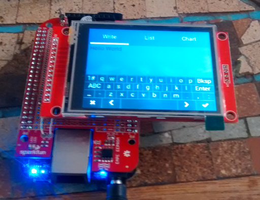

## Running littlevgl on a Beaglebone Black
This directory contains the device tree files to enable an ILI9341 and TSC2046-based resistive touch LCD panel to work with the Beaglebone Black.  It's included here primarily as an aid to anyone who wants to use [littlvgl](https://littlevgl.com/) as a GUI on the BBB.




### Hardware
The hardware is built on a Sparkfun Beaglebone Black expansion cape with a ILI9341 and TSC2046-based 320x240 pixel touch LCD module I got from Amazon (labeled "2.8 TFT SPI 240X320 V1.2").  Connetion between the LCD module and BBB are as follows.

| BBB Header Pin | Function   | Module/Pin    |
|:--------------:|:----------:|:-------------:|
| P9-1           | GND        | LCD GND       |
| P9-5           | 5V         | LCD VCC       |
| P9-12          | GPIO 60    | LCD DC        |
| P9-14          | EHRPWM1A   | LCD LED       |
| P9-15          | GPIO 48    | LCD RESET     |
| P9-17          | SPI0 CS0   | LCD CS        |
| P9-18          | SPI0 MOSI  | LCD SDI(MOSI) |
| P9-21          | SPI0 MISO  | LCD SDO(MISO) |
| P9-22          | SPI0 SCK   | LCD SCK       |
|                |            |               |
| P9-27          | GPIO 115   | TOUCH IRQ     |
| P9-28          | SPI1 CS1   | TOUCH CS      |
| P9-29          | SPI1 MISO  | TOUCH DO (MISO) |
| P9-30          | SPI1 MOSI  | TOUCH DIN (MOSI) |
| P9-31          | SPI1 SCLK  | TOUCH CLK     |

### Device Tree
The ```BB-TOUCH-TFT.dts``` contains the necessary device tree description and fragments to enable both the frame-buffer driver for the ILI9341 LCD controller and the touchscreen driver for the TSC2046 resistive touchscreen controller (ADS7846 compatible).  It first frees the default cape-universal gpio helpers and recreates them without the pins necessary to interface with the controllers.  Spi0 is used for the LCD and Spi1 for the touchscreen.

The compiled version, ```BB-TOUCH-TFT.dtbo``` can be copied to ```/lib/firmware```.  A reference to this file should be included in ```/boot/uEnv.txt``` to cause the device drivers to be loaded during boot.

### littlevgl demo
Please see the ```littlevgl_demo``` directory in the ```pocketbeagle``` area of this repository for a description and instructions for getting littlevgl running on the Beaglebone.  The ```demo``` included there will run unmodified on the BBB.