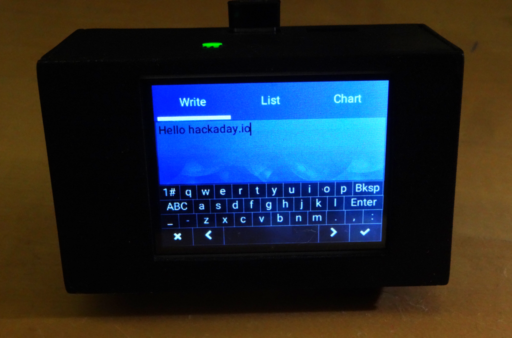
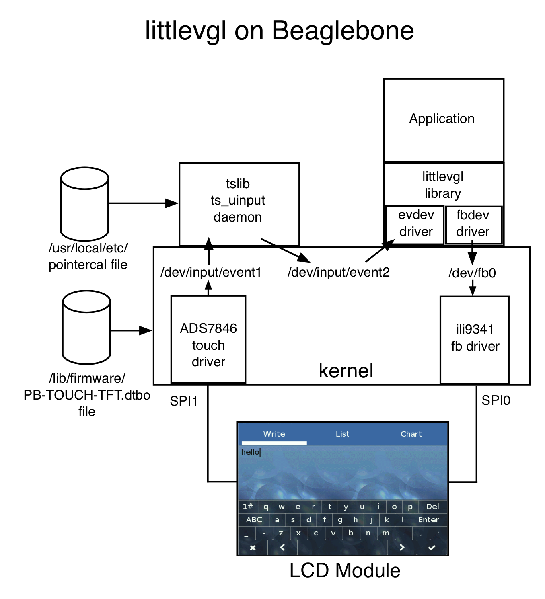

## littlevgl demo
The default [littlvgl](https://littlevgl.com/) demo running on a Pocketbeagle with a ILI9341/TSC2046-based touch LCD screen.



The littlevgl library is configured to use the linux frame buffer output driver and touchscreen input driver.  Using the linux touchscreen driver allows using [tslib](http://www.tslib.org/) to calibrate the resistive touchscreen and de-jitter its input.



### Device Tree
The ```PB-TOUCH-TFT.dts``` contains the necessary device tree description and fragments to enable both the frame-buffer driver for the ILI9341 LCD controller and the touchscreen driver for the TSC2046 resistive touchscreen controller (ADS7846 compatible).  It first frees the default cape-universal gpio helpers and recreates them without the pins necessary to interface with the controllers.  Spi0 is used for the LCD and Spi1 for the touchscreen.

The compiled version, ```PB-TOUCH-TFT.dtbo``` can be copied to ```/lib/firmware```.

The ```uEnv.txt``` file includes the device tree file and can be copied to ```/boot```.

Successfully loading the frame buffer and touchscreen drivers will be indicated in the boot log (via ```dmesg```).  The frame buffer should show up as ```/dev/fb0``` and the touchscreen as ```/dev/input/event1```.

### tslib installation
Download tslib and unpack in a temporary directory.  Then build and install.  I used v1.20.

```
git clone https://github.com/kergoth/tslib.git
cd tslib
./autogen.sh
./configure
make 
sudo make install
```

It will install the library, some utilities and a daemon, all executable as root.  I include command lines here that run as root and configure necessary environment variables.  You could also setup your environment and ```chmod``` the tslib utilities to run as a normal user.

#### Calibrate the touchscreen
Run ```ts_calibrate``` to create the ```/usr/local/etc/pointercal``` calibration file for your touchscreen.

```
sudo TSLIB_FBDEVICE=/dev/fb0 TSLIB_TSDEVICE=/dev/input/event1 TSLIB_CALIBFILE=/usr/local/etc/pointercal TSLIB_CONFFILE=/usr/local/etc/ts.conf TSLIB_PLUGINDIR=/usr/local/lib/ts LD_LIBRARY_PATH=/lib:/usr/lib:/usr/local/lib ts_calibrate
```

You can run ```ts_test``` to verify the calibration.

```
sudo TSLIB_FBDEVICE=/dev/fb0 TSLIB_TSDEVICE=/dev/input/event1 TSLIB_CALIBFILE=/usr/local/etc/pointercal TSLIB_CONFFILE=/usr/local/etc/ts.conf TSLIB_PLUGINDIR=/usr/local/lib/ts LD_LIBRARY_PATH=/lib:/usr/lib:/usr/local/lib ts_test
```

#### Run the tslib daemon
The ```ts_input``` program can be run as a daemon to take raw data from ```/dev/input/event1```, de-jitter it and run it through the calibration values and generate useable data at ```/dev/input/event2```.  chmod ```event2``` to make it available to non-root applications.

```
sudo TSLIB_FBDEVICE=/dev/fb0 TSLIB_TSDEVICE=/dev/input/event1 TSLIB_CALIBFILE=/usr/local/etc/pointercal TSLIB_CONFFILE=/usr/local/etc/ts.conf TSLIB_PLUGINDIR=/usr/local/lib/ts LD_LIBRARY_PATH=/lib:/usr/lib:/usr/local/lib ts_uinput -d -v

sudo chmod 666 /dev/input/event2
```

### littlevgl configuration
The ```demo``` directory contains an installation of littlevgl v6.0 configured to run on the Pocketbeagle and a pre-compiled version of the demo executable.

You can also download the three packages (lvgl, lvgl\_drivers and lvgl\_examples) from the [littlevgl](https://littlevgl.com/download) website.

Two files are customized to configure littlevgl for the system.  ```lv_drv_conf.h``` configures it to use the linux frame buffer (```#define USE_FBDEV```) and the evdev linux input (```#define USE_EVDEV```).  The ```lv_ex_conf.h``` file configures optional features in the demo itself.

A quick and dirty ```Makefile``` allows compilation from the command line.  This builds the entire library every time so is a bit slow.  It certainly could use optimization for a real project...

```
make
```

To run the demo:

```
./demo
```