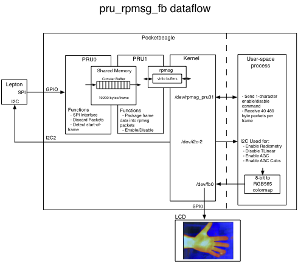

## Pocketbeagle Lepton VoSPI using PRUs & rpmsg 

This directory contains the port from the Beaglebone Black version of PRU firmware and several applications using it to read data from the FLIR Lepton 3.5.  Documentation in this readme is copied from the Beaglebone Black directory readme for convenience.

The implementation uses both PRUs and the rpmsg facility to communciate complete frames to a user application.  It enables AGC in the Lepton in order to reduce the frame size to 19200 bytes.  The two PRUs communicate using a circular buffer in the 12K shared memory block.  Since the circular buffer is smaller than a frame, the code's timing is such that after the pushing PRU (0) indicates valid data, the popping PRU (1) extracts data at a rate that never gets ahead of the pushing PRU or allows it to push data before its extracted.  This is the power of PRU real-time programming!  That, and the fact that the whole process consumes less than 2% of the main processor's time.



PRU0 implements a bit-banged SPI interface running around 16 MHz that constantly reads packets from the Lepton.  It discards packets under two conditions.  When it sees a discard packet from the Lepton and when it has pushed a complete frame and is waiting for PRU1 to signal that it has pushed a complete frame to the kernal using the rpmsg facility.  PRU0 writes valid packets into the shared memory circular buffer.  Each packet written to the circular buffer is 80 bytes (PRU0 assumes the Lepton is in AGC mode and discards the upper byte of each 16-bit data word).  It restarts acquisition every time it sees a packet with an unexpected packet number.  It triggers PRU1 when it sees segment 1 indicated in packet 20.  PRU0 reads one packet every 128 uSec.  It doesn't currently check the Lepton packet CRC but has enough left-over processing power to do that in the future if necessary.

PRU1 combines six 80-byte packets together into one rpmsg message along with a sequence number (481 bytes total - out of the maximum 496 available in a maximum 512 byte rpmsg buffer).  It writes the combined set of packets to the kernal's buffers every 1024 uSec.  PRU1 also looks for simple enable/disable messages from the user space process.  One complete frame will be available about every 111 mSec.  It takes about 41 mSec to transfer the frame to the kernel.

Two bytes in the shared memory block are used for the PRUs to communicate with each other.  The first byte is used by PRU1 to signal to PRU0 that user software has enabled or disabled operation.  The second byte is used by PRU0 to communicate to PRU1 when it thinks it has seen the start of a valid frame (valid packets up to segment 1, packet 20) and PRU1 can start uploading messages through rpmsg.  PRU0 will signal an abort to PRU1 through the second byte if it detects an invalid sequence of packets after initially triggering PRU1 to start the upload process.  In this case PRU1 signals the user process by sending a rpmsg message with an illegal sequence number so the user process can throw away the frame.  PRU1 clears the second byte when it is finished uploading a complete frame or to acknolwedge that it saw the abort message. 

User code communicates with PRU1 using the rpmsg facility.  PRU1 initializes the rpmsg facility in the kernel when it starts operation.  This creates the ```/dev/rpmsg_pru31``` device file used by the user space code.  User space code can read and write this as a simple character device.  Writing a '1' to it will start the PRUs acquiring frame data from the Lepton.  Writing '0' to it will stop the PRU frame data acquisition.  Once frame data acquisition is initiated the user process must immediately start reading the device file for frame data or the kernel will complain vociferously in its log files (one error message for each PRU1 rpmsg message that overflows the 32-entry virtio queue).  Each read should return 481 bytes of data.  The first byte is a sequence number (0 - 39) and subsequent bytes are 8-bit pixel data from the Lepton - a total of 19200 bytes for 160 x 120 8-bit pixels.

User code configures the Lepton using its I2C interface connected to the PB I2C2 port (```/dev/i2c-2```).  As mentioned above, the Lepton must have AGC enabled because this code wants the smallest set of frame data possible, plus AGC images look better.

The remoteproc facility is used to load firmware into the PRUs and to start and stop them.

Code was developed on the 4.14.71 kernel.  Unfortunately, I can't give any assurances it will work with different kernels.

```
Linux beaglebone 4.14.71-ti-r80 #1 SMP PREEMPT Fri Oct 5 23:50:11 UTC 2018 armv7l GNU/Linux
```

### Setup

You must configure several things before any of this code will run.  I started by loading the Debian 9.5 IOT image onto a micro-SD card from [https://beagleboard.org/latest-images](https://beagleboard.org/latest-images).  You will find instructions there for installing the OS.

#### Copy Device Tree Files
There are two device tree files, located in the ```dts``` directory, used to configure the frame buffer and LCD interface, and the PRU GPIO signals.

1. ```PB-TFT-ILI9348-SPI0.dts``` configures a linux frame buffer to use the display connected to SPI0.  It also configures a PWM driver for the backlight brightness control.
2. ```PB-PRU-RPMSG-LEP-SPI.dts``` configures several of the Pocketbeagle GPIO pins for use by the PRUs.

These files both tell the system how to configure the GPIO pinmux but also configure kernel modules and are compiled into binary objects using the "dtc" program.  Precompiled versions with the ".dtbo" suffix are available and should be copied into the ```/lib/firmware``` directory.

```
cd dts
sudo cp PB-TFT-ILI9348-SPI0.dtbo /lib/firmware
sudo cp PB-PRU-RPMSG-LEP-SPI.dtbo /lib/firmware
```


#### Copy firmware
Binary firmware files must be made available to the system for the remoteproc facility to be able to load them into the PRU memory.  See the firmware section below for instructions on building the firmware.  Pre-compiled versions exist in the ```firmware/gen``` subdirectory and should be copied to the ```/lib/firmware``` directory.

```
cd firmware/gen
sudo cp pru0_main.out /lib/firmware/am335x-pru0-fw
sudo cp pru1_main.out /lib/firmware/am335x-pru1-fw
```

#### Edit uEnv.txt
The ```/boot/uEnv.txt``` file reads the compiled device tree files and configures the Pocketbeagle on boot.  Edit it to add the following lines to enable the frame buffer and the PRU VoSPI interface.  Alternatively replace it with the version you find in this repository.

```
###Additional custom capes
#uboot_overlay_addr4=/lib/firmware/<file4>.dtbo
uboot_overlay_addr4=/lib/firmware/PB-PRU-RPMSG-LEP-SPI.dtbo
```
```
###Custom Cape
#dtb_overlay=/lib/firmware/<file8>.dtbo
dtb_overlay=/lib/firmware/PB-TFT-ILI9348-SPI0.dtbo
```

Also change the kernel boot parameters so that it won't start a console on the frame buffer (which causes it to annoyingly blink a cursor in and amonst our updating of the LCD with image data).  Add the text ```vt.global_cursor_default=0``` to the end of the ```cmdline``` string.

```
cmdline=coherent_pool=1M net.ifnames=0 quiet vt.global_cursor_default=0
```

#### Reboot the Pocketbeagle

You should see the LCD backlight light indicating that the OS successfully loaded the device tree files.  You can see if the kernel successfully configured the LCD frame buffer using ```dmesg```.  You will also see a ```/dev/fb0``` device file.

```
[   26.778851] fbtft: module is from the staging directory, the quality is unknown, you have been warned.
[   27.113910] fb_ili9341: module is from the staging directory, the quality is unknown, you have been warned.
[   27.115081] fbtft_of_value: buswidth = 8
[   27.115096] fbtft_of_value: debug = 3
[   27.115103] fbtft_of_value: rotate = 90
[   27.115110] fbtft_of_value: fps = 30
[   27.115345] fb_ili9341 spi1.0: fbtft_gamma_parse_str() str=
[   27.115354] fb_ili9341 spi1.0: 1F 1A 18 0A 0F 06 45 87 32 0A 07 02 07 05 00
               00 25 27 05 10 09 3A 78 4D 05 18 0D 38 3A 1F
[   27.280196] fb_ili9341 spi1.0: fbtft_request_one_gpio: 'reset-gpios' = GPIO48
[   27.280230] fb_ili9341 spi1.0: fbtft_request_one_gpio: 'dc-gpios' = GPIO60
[   27.280285] fb_ili9341 spi1.0: fbtft_verify_gpios()
[   27.280293] fb_ili9341 spi1.0: fbtft_reset()
[   32.259756] fb_ili9341 spi1.0: Display update: 1203 kB/s, fps=0
[   32.260857] Console: switching to colour frame buffer device 40x30
[   32.261566] graphics fb0: fb_ili9341 frame buffer, 320x240, 150 KiB video memory, 16 KiB buffer memory, fps=31, spi1.0 at 25 MHz
```

### Software

Several applications are in the ```app``` directory.  Source and header files are in subdirectories.

1. ```pru_rpmsg_fb``` simply displays the VoSPI stream on the LCD.  It takes one optional argument, a number from 0 - 3, indicating which colormap to use.
2. ```pru_leptonic``` and ```zmq_fb``` use the ZMQ socket interface that Damien Walsh's original [leptonic](https://github.com/themainframe/leptonic) program used.  The ```pru_leptonic``` program acts as a server and can send image data to clients like ```zmq_fb``` and Damien's original webserver.
3. ```ffc``` runs a Flat Field Correction on the Lepton using the I2C interface.  ```reboot_lep``` runs a reboot sequence (and takes several seconds to finish).  These are useful when the Lepton gets confused as I have seen happen occasionally.  Use them if you can't get a stream started with one of the other programs.  

#### Building

```
cd app
make clean
make
```
Should yield a successful build (you might have to install zmq but I didn't on my distribution).

```gcc -g -DLOG_USE_COLOR=1 -Wall -pthread -I include/ src/cci.c src/fb.c src/log.c src/pru_rpmsg_fb.c src/vospi.c -o pru_rpmsg_fb
gcc -g -DLOG_USE_COLOR=1 -Wall -lzmq -pthread -I include/ src/cci.c src/log.c src/pru_leptonic.c src/vospi.c -o pru_leptonic
gcc -g -DLOG_USE_COLOR=1 -Wall -lzmq -pthread -I include/ src/fb.c src/log.c src/zmq_fb.c -o zmq_fb
gcc -g -DLOG_USE_COLOR=1 -Wall -I include/ src/cci.c src/log.c src/reboot_lep.c -o reboot_lep
gcc -g -DLOG_USE_COLOR=1 -Wall -I include/ src/cci.c src/log.c src/ffc.c -o ffc
```

#### Set user permissions
I like to run and control the applications as a normal user.  By default, at least on my system, the remoteproc files used to manage the PRUs and the rpmsg device file created when the PRUs start running are not writable by the ```debian``` user.

See the ```scripts``` directory for some Bash scripts that encapsulate these operations but the actual process is described here.  They must be performed each time the system boots.

First set permissions so you can start and stop the PRUs (and load new firmware if necessary).

```
sudo chmod 666 /sys/class/remoteproc/remoteproc1/state
sudo chmod 666 /sys/class/remoteproc/remoteproc1/firmware
sudo chmod 666 /sys/class/remoteproc/remoteproc2/state
sudo chmod 666 /sys/class/remoteproc/remoteproc2/firmware
```

Then, after starting the PRUs (see below), set the rpmsg device file to be accessible by programs run by the default user.  This must be performed each time PRU1 starts (or restarts) and establishs an rpmsg channel with the system.

```
sudo chmod 666 /dev/rpmsg_pru31
```

#### Start firmware
The PRU firmware must be started before any of the main applications will run.  Execute the following commands.

```
echo "start" > /sys/class/remoteproc/remoteproc1/state
echo "start" > /sys/class/remoteproc/remoteproc2/state
```

Note you must echo ```stop``` to the remoteproc state variable before attempting to load new firwmare.  By default the system should load the firmware it finds in ```/lib/firmware``` when it boots (or when you start the PRU - I'm not sure which).

To (re)load firmware, first stop the PRUs by echoing the word ```stop``` to the state device files and then execute the following commands.

```
echo "am335x-pru0-fw" > /sys/class/remoteproc/remoteproc1/firmware
echo "am335x-pru1-fw" > /sys/class/remoteproc/remoteproc2/firmware
```


#### Run an application

To run ```pru_rpmsg_rb``` with the "Iron Black" colormap (option 3):

```
debian@beaglebone:~/pru_rpmsg_fb/app$ ./pru_rpmsg_fb 3
23:47:51 INFO  src/pru_rpmsg_fb.c:214: Preallocating space for frames...
23:47:51 INFO  src/pru_rpmsg_fb.c:61: opening I2C device ... /dev/i2c-2
23:47:51 INFO  src/pru_rpmsg_fb.c:80:   Radiometry = 1
23:47:51 INFO  src/pru_rpmsg_fb.c:83:   Radiometry TLinear = 0
23:47:51 INFO  src/pru_rpmsg_fb.c:88:   AGC Calc En = 1
23:47:51 INFO  src/pru_rpmsg_fb.c:93:   AGC = 1
23:47:51 INFO  src/pru_rpmsg_fb.c:232: Creating get_frames_from_device thread
23:47:51 INFO  src/pru_rpmsg_fb.c:238: Creating send_frames_to_fb thread
23:47:51 INFO  src/fb.c:34: The framebuffer device was opened successfully.
23:47:51 INFO  src/fb.c:49: FB: 320x240, 16bpp, length 640, offsets: 0 0
23:47:51 INFO  src/fb.c:61: Framebuffer device mapped to memory successfully.
23:47:51 INFO  src/pru_rpmsg_fb.c:114: opening PRU ... /dev/rpmsg_pru31
23:47:51 INFO  src/pru_rpmsg_fb.c:127: Starting VoSPI transfers
```

You should be rewarded with a live image on the LCD.

#### Automatic start-up
The ```run_pru_rpmsg_fb.sh``` script may be called from ```/etc/rc.local``` to automatically run ```pru_rpmsg_fb``` at start-up.  For example add the following lines to ```/etc/rc.local``` as root.

	# Start pru_rpmsg
	home/debian/pru_rpmsg_fb/scripts/run_pru_rpmsg_fb.sh &


### Firmware
The PRU firmware (in the ```firmware``` subdirectory) make use of rpmsg as it existed for the 4.14 kernel (it seems to be a moving target).  There is a lot of stuff on the web explaining how to communicate with the PRUs.  A lot of it was out of date when I went looking.  I found [Andrew Wright's](http://theduchy.ualr.edu/?p=996) example to be useful, as well as perusing TI's source in ```/usr/lib/ti/pru-software-support-package``` on my Pocketbeagle and even found looking at kernel source to be ultimately necessary.

The following files are interesting.

1. ```AM335x_PRU.cmd``` is a boilerplate file used to tell the linker where various devices are in memory (it's cool and scary that the PRUs can access the entire physical memory map of the system).  This file is useful to quickly remind oneself where the absolute memory location is when using [prudebug](https://github.com/poopgiggle/prudebug).
2. ```pru_common.h``` contains addresses of the circular buffer and communication locations in shared memory used by both PRUs.
3. ```pru{0,1}_main.c``` are the source files for each PRU.
4. ```resource_table_{0,1}.h``` contain the resource table data structure used by remoteproc and (for PRU1) the data structures used by rpmsg.
5. ```gen``` directory is used for built objects.  The ```.out``` files are the actual binary files to load.  The ```.map``` files show you where the compiler put everything.


#### Building firmware

```
cd firmware
make clean
make
```

Should yield the following.

```
debian@beaglebone:~/pru_rpmsg_fb/firmware$ make clean

************************************************************
Cleaning project: firmware

Removing files in the "gen" directory

Finished cleaning project: firmware
************************************************************

debian@beaglebone:~/pru_rpmsg_fb/firmware$ make 

************************************************************
Building project: firmware

Building file: pru0_main.c
Invoking: PRU Compiler
/usr/bin/clpru --include_path=/usr/share/ti/cgt-pru//include --include_path=/usr/share/ti/cgt-pru/include --include_path=/usr/lib/ti/pru-software-support-package/include/ --include_path=/usr/lib/ti/pru-software-support-package/include/am335x/ -v3 -O2 --display_error_number --endian=little --hardware_mac=on --obj_directory=gen --pp_directory=gen -ppd -ppa -fe gen/pru0_main.object pru0_main.c

Building target: gen/pru0_main.out
Invoking: PRU Linker
/usr/bin/clpru -v3 -O2 --display_error_number --endian=little --hardware_mac=on --obj_directory=gen --pp_directory=gen -ppd -ppa -z -i/usr/share/ti/cgt-pru//lib -i/usr/share/ti/cgt-pru//include --reread_libs --warn_sections --stack_size=0x100 --heap_size=0x100 -o gen/pru0_main.out gen/pru0_main.object -mgen/pru0_main.map ./AM335x_PRU.cmd --library=libc.a --library=/usr/lib/ti/pru-software-support-package/lib/rpmsg_lib.lib --library=/usr/share/ti/cgt-pru/lib/libc.a
<Linking>
Finished building target: gen/pru0_main.out

Building file: pru1_main.c
Invoking: PRU Compiler
/usr/bin/clpru --include_path=/usr/share/ti/cgt-pru//include --include_path=/usr/share/ti/cgt-pru/include --include_path=/usr/lib/ti/pru-software-support-package/include/ --include_path=/usr/lib/ti/pru-software-support-package/include/am335x/ -v3 -O2 --display_error_number --endian=little --hardware_mac=on --obj_directory=gen --pp_directory=gen -ppd -ppa -fe gen/pru1_main.object pru1_main.c

Building target: gen/pru1_main.out
Invoking: PRU Linker
/usr/bin/clpru -v3 -O2 --display_error_number --endian=little --hardware_mac=on --obj_directory=gen --pp_directory=gen -ppd -ppa -z -i/usr/share/ti/cgt-pru//lib -i/usr/share/ti/cgt-pru//include --reread_libs --warn_sections --stack_size=0x100 --heap_size=0x100 -o gen/pru1_main.out gen/pru1_main.object -mgen/pru1_main.map ./AM335x_PRU.cmd --library=libc.a --library=/usr/lib/ti/pru-software-support-package/lib/rpmsg_lib.lib --library=/usr/share/ti/cgt-pru/lib/libc.a
<Linking>
Finished building target: gen/pru1_main.out

Finished building project: firmware
************************************************************
```

Stop the PRUs and copy the firmware to ```/lib/firmware``` as shown above.  Then restart the PRUs to execute your new firmware.

```
echo "stop" > /sys/class/remoteproc/remoteproc1/state
echo "stop" > /sys/class/remoteproc/remoteproc2/state
sudo cp pru0_main.out /lib/firmware/am335x-pru0-fw
echo "am335x-pru0-fw" > /sys/class/remoteproc/remoteproc1/firmware
sudo cp pru1_main.out /lib/firmware/am335x-pru1-fw
echo "am335x-pru1-fw" > /sys/class/remoteproc/remoteproc2/firmware
echo "start" > /sys/class/remoteproc/remoteproc1/state
echo "start" > /sys/class/remoteproc/remoteproc2/state
```


#### Random notes
The following rpmsg limitations bit me.  Just FYI.

1. The kernel only creates space for 32 rpmsg 512 byte messages.
2. The rpmsg driver logs failures and if your PRU is super busy shoveling messages up but nothing is reading them then you are going to get a *lot* of error messages in your log files.  I was able to bring my system to its knees.  This firmware attempts to stop when the kernel's buffers are full but YMMV depending on the situation.
