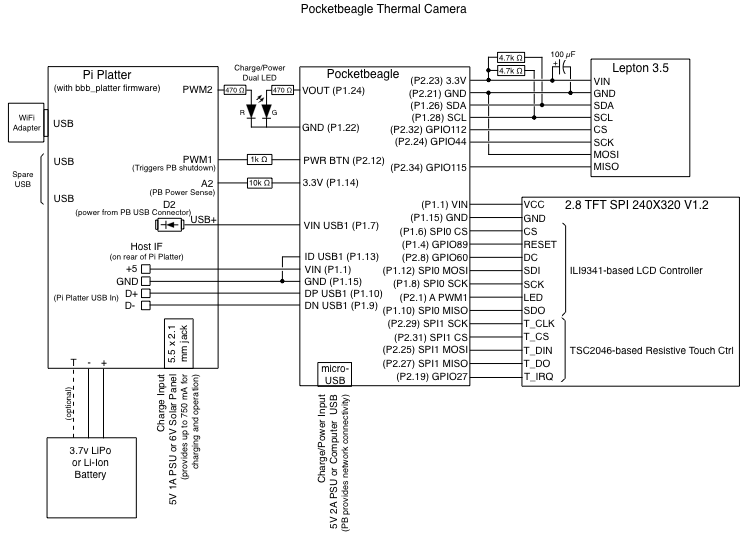
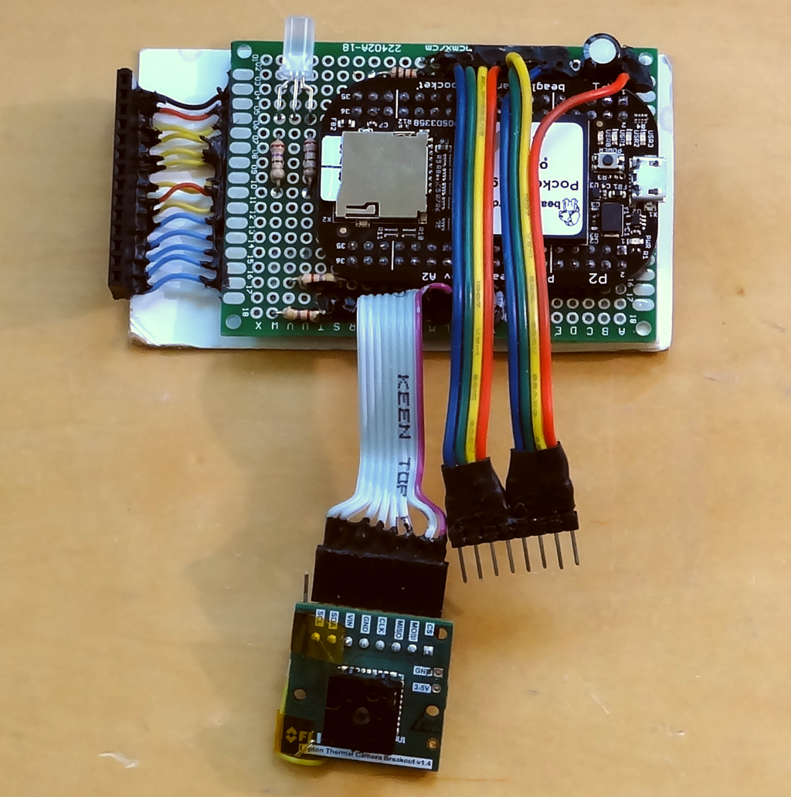
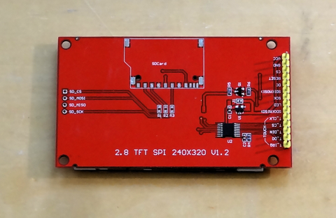
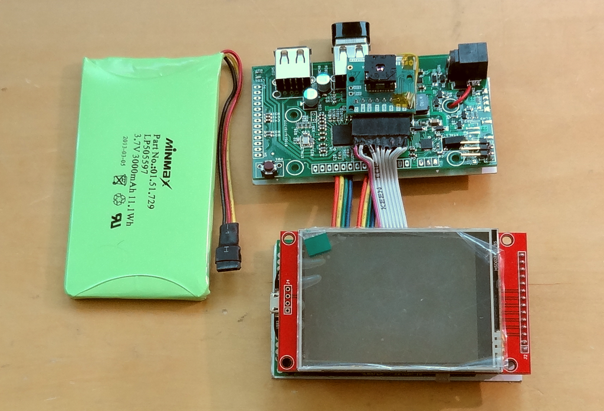
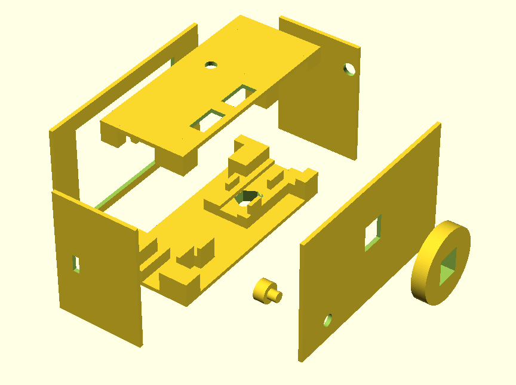
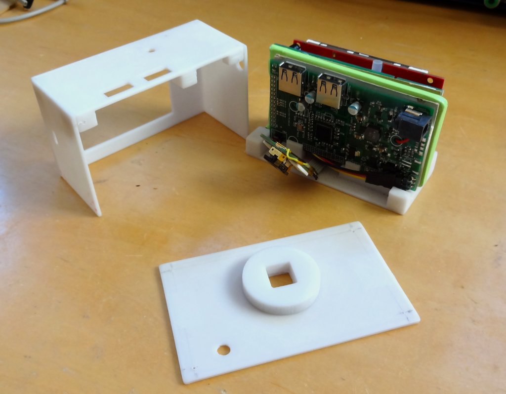

# Pocketbeagle Code and Hardware
The tiny Pocketbeagle forms the core of a complete thermal imaging camera using the Lepton 3.5 and a modified Solar Pi Platter board powered by a 3.7V 3000 mAh LiPo battery.  This directory contains the design of the camera and various pieces of software written to run on it.


## Software
### pru\_rpmsg\_fb
A port of the code originally written for the Beaglebone Black to the Pocketbeagle to display a simple image on the attached LCD screen.  The primary differences are the device tree files for the PRU/Lepton interface and SPI/LCD interface and the ```uEnv.txt``` file that uses them.  The PRU firmware implementing the VoSPI pipeline is also modified for the different pins used on the Pocketbeagle, but otherwise the same as the Beaglebone Black version.

## Camera Hardware
The hardware consists of several subsystems wired together.

### Schematic


A dual red/green common-cathod LED provides indication of charging state and power.  The red LED lights when the battery is charging and the Green LED lights when the system is powered.

An optional USB WiFi dongle provides network access.

### Pocketbeagle board
Pocketbeagle on a proto-board with external discrete components and connections to other modules.



The wire connection to the LCD connector shown above proved to be unreliable because flexing the cable during repeated camera assembly and disassembly eventually broke the solder connections.  Ultimately I replaced it with a connector on another proto-board securely mounted in the same plane as the Pocketbeagle proto-board.

### 2.8" LCD with resistive touch
I used commonly available and inexpensive LCD module and removed the unused SD-card circuitry to prevent it from pressing against the Pocketbeagle wiring in the case.  I bought my module from Amazon but they are readily available from other sources as well.



### Modified Solar Pi Platter and Battery
My own Solar Pi Platter design was repurposed to provide power management and IO expansion for the camera.  It is documented in the ```bbb_platter``` directory.



The battery shown above includes a 10k thermistor connected to the Pi Platter for battery temperature monitoring.  This is optional.  Batteries from traditional suppliers like Adafruit and Sparkfun that do not include a thermistor may also be used.  I get several hours of operation from the 3000 mAh battery.

### Cardboard
I used two pieces of thin cardboard behind the two PCBs to smoothly sandwich the battery. 

### bbb_platter
Directory containing documentation and firmware to modify the Solar Pi Platter into a power management and IO expansion board for the Pocketbeagle.

### enclosure
Eight 3D printed parts are used to create an enclosure.  The parts were designed using OpenSCAD.  The source files and STL files are included in this directory.  You will need to slice the STL files into gcode for your 3D printer.

1. base.scad - Camera base including a cut-out for a tripod-mounting nut.  Includes guides to hold the various internal components of the camera and blocks that can be used to screw the front, side and rear plates to the base.
2. button.scad - A simple button that rides on top of the physical switch on the Pi Platter board and pokes out the rear of the camera to allow the user to power on/off.
3. front2.scad - The LCD bezel.
4. rear_lens.scad - A protective shield for the Lepton module that mounts to the rear plate of the camera.
5. rear_smooth.scad - The rear plate including a cut-out for the Lepton and hole for the power button.
6. side1.scad - A side plate with hole for the Pi Platter 5.5x2.1mm power jack.
7. side2.scad - A side plat with cutout for the Pocketbeagle Micro-USB port.
8. top.scad - Camera top with hole for the charge/power LED and cut-outs for two USB Type-A expansion ports.  Includes guides to hold the various internal components of the camera and blocks that can be used to screw the front, side and rear plates to the base.



I glued the front, sides and top together before sanding and painting the camera.  I also glued the rear_lens to the rear plate.  Then these two assemblies and the bottom are held together with screws to allow access to the camera internals.  I drilled small holes through the combined assemblies and then used small screws slightly larger than the holes to hold the parts together.  The camera was painted using a textured black spray paint over a gray primer and then clear coated.  Several layers of each paint were used.

