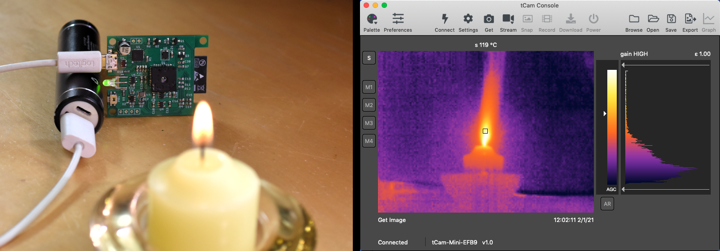
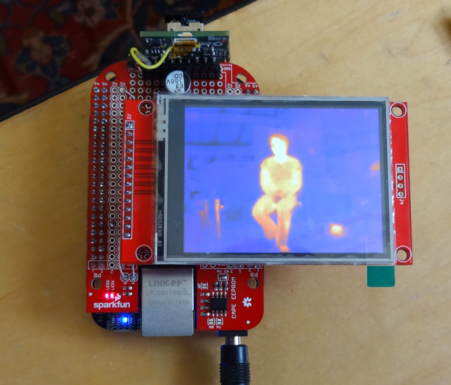
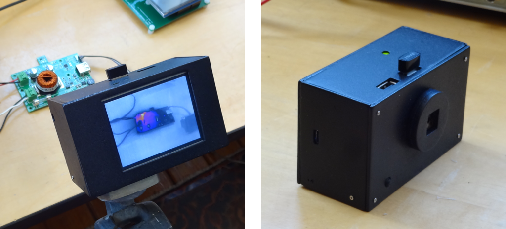
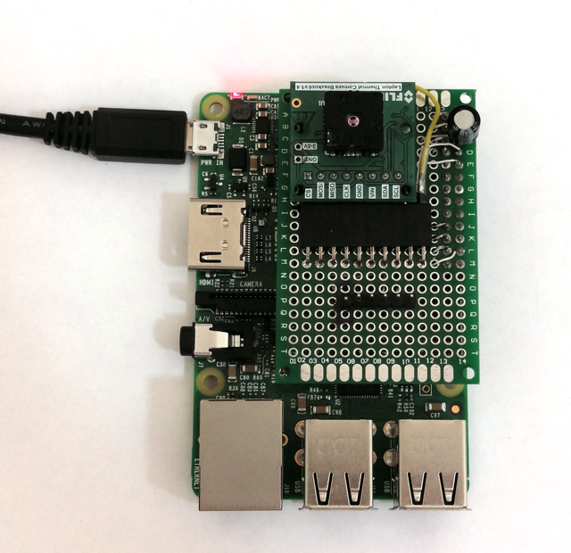
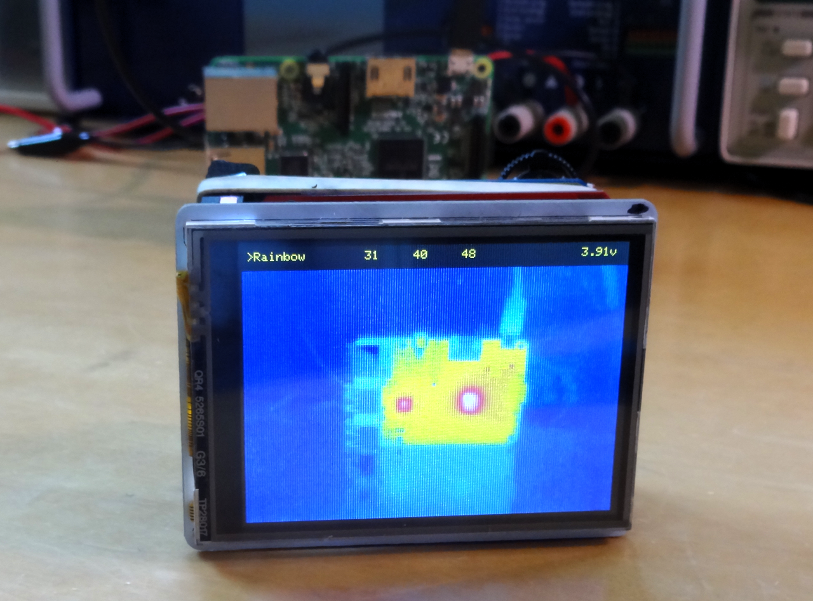

## FLIR Lepton Code

This repository contains code, libraries and hardware I developed over the course of making a series of thermal imaging cameras based on the FLIR Lepton 3.5 camera or [module](https://store.groupgets.com/collections/flir-lepton-accessories/products/flir-lepton-breakout-board) on many different platforms.

The project process is documented at [hackaday.io](https://hackaday.io/project/159615-lepton-35-thermal-imaging-camera).

### ESP32
Contains code, design information and supporting applications for a pair of cameras based around the ESP32.

 

# Note

As of Nov 6 2022, the ESP32 designs have been moved to their own respository [tCam](https://www.github.com/danjulio/tCam) to make it easier for most people who are only interested in those files.  Files here will no longer be updated.

### beaglebone
Code for the Beaglebone Black including my initial PRU-based VoSPI video pipleline and LCD display.

### pocketbeagle
The pocketbeagle was used for the final design of a thermal imaging camera.  This directory contains the code supporting the camera and the re-targeting of my Solar Pi Platter as a power-management and expansion board for the Pocketbeagle.

### raspberrypi
Contains a modified version of Damien Walsh's great [leptonic](https://github.com/themainframe/leptonic) program running on the Raspberry Pi.  My version uses the VSYNC output from the Lepton to synchronize the VoSPI transfer as an experiment to increase the reliability of syncing a user-space process to the Lepton video stream.

### teensy3
Contains the code I wrote initially for a test platform based on the PJRC Teensy 3.2 board to learn about the Lepton.  Also includes a port of FLIR's LeptonSDKEmb32OEM CCI to the Arduino platform.

