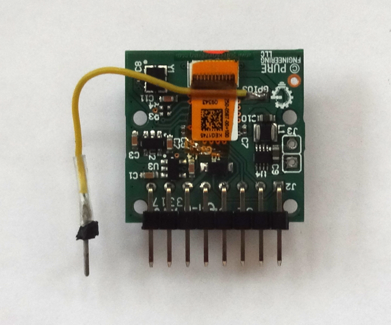

## Lepton Code

This repository contains code and libraries developed for a FLIR Lepton 3.5 Thermal imaging camera [module](https://store.groupgets.com/collections/flir-lepton-accessories/products/flir-lepton-breakout-board).

### Teensy3
Code for a test platform based on the PJRC Teensy 3 board.  Also includes a port of FLIR's LeptonSDKEmb32OEM CCI to the Arduino platform.

### leptonic-vsync
A version of Damien Walsh's leptonic server program for the Raspberry Pi that uses VSYNC and an ISR running in user-space on the Pi to sync the Lepton's VoSPI data.


#### Hardware


Connect the Lepton module's power, I2C, SPI and VSYNC output to the Pi as follows.  

| Pi Header Pin | Function | Lepton Module |
|:-------------:|:--------:|:-------------:|
| 1             | 3V3      | VIN           |
| 3             | SDA      | SDA           |
| 5             | SCL      | SCL           |
| 6             | GND      | GND           |
| 7             | VSYNC    | GPIO3         |
| 19            | MOSI     | MOSI          |
| 21            | MISO     | MISO          |
| 23            | SCLK     | SCLK          |
| 24            | CS0      | CS            |

VSYNC can be found on the back of the Lepton module.




#### Software
Download and install Damien's version of [leptonic](https://github.com/themainframe/leptonic) including the dependencies he lists.  In addition, install the [PIGPIO C library](http://abyz.me.uk/rpi/pigpio/) and enable I2C on your pi if necessary using raspi-config.  PIGPIO is used for low-latency user-space interrupt handling.  Download and unpack leptonic-vsync.

```

cd leptonic-vsync
make
sudo ./bin/leptonic /dev/i2c-1 /dev/spidev0.0

```

You should see the leptonic server start up with output like the following.

```
pi@raspberrypi:~/leptonic-vsync $ sudo ./bin/leptonic /dev/i2c-1 /dev/spidev0.0
08:10:14 INFO  src/leptonic.c:223: preallocating space for segments...
08:10:14 INFO  src/leptonic.c:232: Creating get_frames_from_device thread
08:10:14 INFO  src/leptonic.c:238: Creating send_frames_to_socket thread
08:10:14 INFO  src/leptonic.c:80: opening I2C device... /dev/i2c-1
08:10:14 INFO  src/leptonic.c:87: opening SPI device... /dev/spidev0.0
08:10:14 INFO  src/leptonic.c:106: aquiring VoSPI synchronisation
```

Then start the frontend code in the original leptonic frontend directory.

```
npm start
```

You should be able to view the output from the camera on a web browser using the Pi's address at port 3000 as with Damien's original code.

#### AGC
Uncomment out the call to ````cci_set_agc_enable_state```` in leptonic.c to enable AGC.  This results in a slightly better image utilizing the Lepton's built-in AGC functionality.
