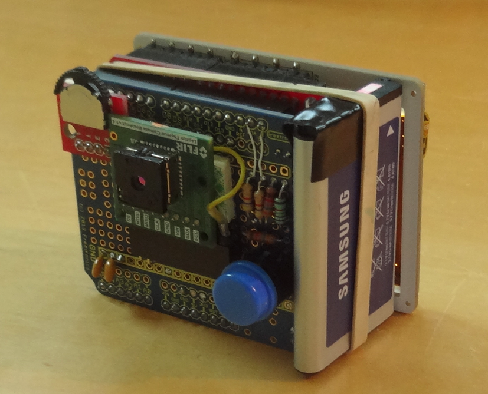

## Teensy 3 Test Platform

This directory contains code for a test platform based on the PJRC Teensy 3.2 development board.  It consists of a set of Arduino-environment sketches and a port of the FLIR IDD library used to control the module via its I2C bus.

The project is documented at [hackaday.io](https://hackaday.io/project/159615-lepton-35-thermal-imaging-camera).  It uses a ILI9341-based 320x240 pixel LCD display.

### Contents

1. LeptonSDKEmb32OEM - FLIR's IDD library ported for operation on the Teensy.  Primarily this required adapting the different sizes of enums on the Teensy platform vs. 32-bit Linux platforms such as the Raspberry Pi.  This library has a dependence on the Teensy i2c_t3 library in case you want to try it on another embedded platform.  It should be put in your Arduino libraries folder.
2. lep_test5 - A test sketch demonstrating the Lepton's built-in AGC function.  Eight-bit output from the Lepton is displayed through a color map.
3. lep_test6 - A test sketch demonstrating the (default) 16-bit Tlinear radiometric data from the Lepton.  Sixteen-bit output from the Lepton is scaled linearly into an 8-bit range and displayed through a color map.  The temperature of the image center is displayed.
4. lep_test7 - 
5. teensy_schematic.pdf - Shows the connections for the test platform including the soft power control and battery charging/boost converter circuitry.

This code is "as-is" and may contain bugs (especially the library as it has a lot of functions I haven't tested).  Please let me know if you have a question or find a bug.
